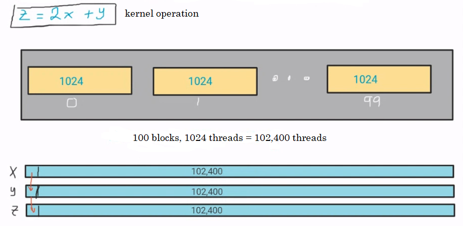

---
title: "Introduction to Parallel Computing with CUDA"
author: [Mariana Avalos Arce]
date: "2021"
keywords: [Markdown, Example]
geometry: margin=1in
fontsize: 12pt
fontenc: T1
fontfamily: sourcesanspro  
fontfamilyoptions: sfdefault
...

# Processing Time in the GPU and CPU

If we were to test the processing time of the same operation over and over, say z = 2x + y, performed both by the CPU and GPU, there would be a noticeable difference if the size of the vectors to store this repeated operations is enormous (102,400 cells). Consider the image below:



### Implementation

```c++
#include "cuda_runtime.h"
#include "device_launch_parameters.h"

#include <stdio.h>
#include <iostream>
#include <time.h>

using namespace std;

__global__ void GPU_fn(int* x, int* y, int* z) {
	int gId = blockIdx.x * blockDim.x + threadIdx.x;
	z[gId] = 2 * x[gId] + y[gId];
}


__host__ void CPU_fn(int* x, int* y, int* z, int vecSize) {
	for (int i = 0; i < vecSize; i++) {
		z[i] = 2 * x[i] + y[i];
	}
}

__host__ void checkCUDAError(const char* msg) {
	cudaError_t error;
	cudaDeviceSynchronize();
	error = cudaGetLastError();
	if (error != cudaSuccess) {
		printf("ERROR %d: %s (%s)\n", error, cudaGetErrorString(error), msg);
	}
}

__host__ void validate(int* result_CPU, int* result_GPU, int N) {
	for (int i = 0; i < N; i++) {
		if (result_CPU[i] != result_GPU[i]) {
			printf("The vectors are not equal\n");
			return;
		}
	}
	printf("Kernel validated successfully\n");
	return;
}

int main()
{
	cudaDeviceProp prop;
	cudaGetDeviceProperties(&prop, 0);
	printf("maxThreadsPerBlock: %d\n", prop.maxThreadsPerBlock); // 1024 in all its block dimension
	printf("maxThreadsDim[0]: %d\n", prop.maxThreadsDim[0]); // 1024 in a block's x dim
	// 100 blocks x 1024 threads = 102 400 threads
	// x,y,z vectors of size 1024

	int numBlocks = 100000; // add one zero and you get ERROR 2: run out of global memory
	int numThreadsPerBlock = 1024;
	int vecSize = numBlocks * numThreadsPerBlock;


	int* hostx = (int*)malloc(vecSize * sizeof(int));
	int* hosty = (int*)malloc(vecSize * sizeof(int));
	int* hostzCPU = (int*)malloc(vecSize * sizeof(int));
	int* hostzGPU = (int*)malloc(vecSize * sizeof(int));

	int* devx, * devy, * devz;
	cudaMalloc((void**)&devx, vecSize * sizeof(int));
	checkCUDAError("Error at cudaMalloc: devx");
	cudaMalloc((void**)&devy, vecSize * sizeof(int));
	checkCUDAError("Error at cudaMalloc: devy");
	cudaMalloc((void**)&devz, vecSize * sizeof(int));
	checkCUDAError("Error at cudaMalloc: devz");

	for (int i = 0; i < vecSize; i++) {
		hostx[i] = 1;
		hosty[i] = 2;
	}

	cudaMemcpy(devx, hostx, vecSize * sizeof(int), cudaMemcpyHostToDevice);
	cudaMemcpy(devy, hosty, vecSize * sizeof(int), cudaMemcpyHostToDevice);
	dim3 block(numThreadsPerBlock);
	dim3 grid(numBlocks);

	cudaEvent_t startGPU;
	cudaEvent_t endGPU;
	cudaEventCreate(&startGPU);
	cudaEventCreate(&endGPU); // be able to mark the time
	cudaEventRecord(startGPU); // save current time
	GPU_fn << <grid, block >> > (devx, devy, devz);
	cudaEventRecord(endGPU);
	cudaEventSynchronize(endGPU); // so that cudaEventRecord(startGPU) and cudaEventSynchronize(endGPU) are not done at the same time
	float elapsedTimeGPU;
	cudaEventElapsedTime(&elapsedTimeGPU, startGPU, endGPU);
	cudaMemcpy(hostzGPU, devz, vecSize * sizeof(int), cudaMemcpyDeviceToHost);

	clock_t startCPU = clock(); // save current time
	CPU_fn(hostx, hosty, hostzCPU, vecSize);
	clock_t endCPU = clock();
	float elapsedTimeCPU = endCPU - startCPU;
	printf("Time elapsed CPU: %f miliseconds\n", elapsedTimeCPU);
	printf("Time elapsed GPU: %f miliseconds\n", elapsedTimeGPU);

	validate(hostzCPU, hostzGPU, vecSize);

	free(hostx);
	free(hosty);
	free(hostzCPU);
	free(hostzGPU);
	cudaFree(devx);
	cudaFree(devy);
	cudaFree(devz);

	cudaEventDestroy(startGPU);
	cudaEventDestroy(endGPU);

	return 0;
}
```

### Output

