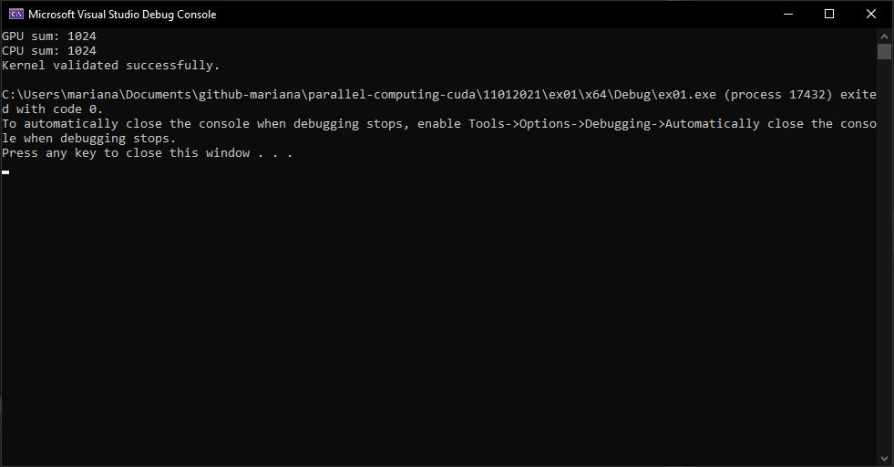

---
title: "Introduction to Parallel Computing with CUDA"
author: [Mariana Avalos Arce]
date: "2021"
keywords: [Markdown, Example]
geometry: margin=1in
fontsize: 12pt
fontenc: T1
fontfamily: sourcesanspro  
fontfamilyoptions: sfdefault
...

# Parallel Reduction

It is a semi-parallel technique that consists in dividing the vector size into 2 and also divide the amount of threads into two: if you have a size 8 vector, you then use 4 threads to sum the index 0 and 4, 1 and 5, and so on. Then when the half vector is covered, the 4 first elements will have the sum of the first and last 4 elements. Then, you repeat the process for the 4 cells remaining: now 2 have two elements of the first and last 2 elements of the remaining vector, etc.

At the end, you will have one cell with the sum of all the vector elements. This cell will be the first cell of the original array, to then return this value in the kernel. Basically have to divide in two and add up the firsts and lasts, the divide that in two again, until you sum up all the elements.

It is not completely in parallel, but it is done in less iterations than a **sequential programming technique such as a for loop**.

- The only condition is that **the vector size is even**.


### Solution

```c++
#include "cuda_runtime.h"
#include "device_launch_parameters.h"

#include <stdio.h>
#include <stdlib.h>

__host__ void checkCUDAError(const char* msg) {
	cudaError_t error;
	cudaDeviceSynchronize();
	error = cudaGetLastError();
	if (error != cudaSuccess) {
		printf("ERROR %d: %s (%s)\n", error, cudaGetErrorString(error), msg);
	}
}

__host__ void validate(int* result_CPU, int* result_GPU, int size) {
	if (*result_CPU != *result_GPU) {
		printf("The results are not equal.\n");
		return;
	}
	printf("Kernel validated successfully.\n");
	return;
}

__host__ void CPU_fn(int *v, int* sum, const int size) {
	for (int i = 0; i < size; i++) {
		*sum += v[i];
	}
}

__global__ void kernel(int* v, int* sum) {
	int gId = threadIdx.x;
	int step = blockDim.x;

	while (step) {
		if (gId < step) {
			v[gId] = v[gId] + v[gId + step];
		}
		step = step / 2;
	}
	if (gId == 0) {
		*sum = v[gId];
	}
}

int main() {

	const int size = 1024;
	int* v = (int*)malloc(sizeof(int) * size);
	int sumCPU = 0;
	int sumGPU = 0;

	int* dev_v, *sum;
	cudaMalloc((void**)&dev_v, sizeof(int) * size);
	cudaMalloc((void**)&sum, sizeof(int));

	for (int i = 0; i < size; i++) {
		v[i] = 1;
	}

	cudaMemcpy(dev_v, v, sizeof(int) * size, cudaMemcpyHostToDevice);
	cudaMemcpy(sum, &sumGPU, sizeof(int), cudaMemcpyHostToDevice);

	dim3 grid(1);
	dim3 block(size);
	
	kernel <<< grid, block >>> (dev_v, sum);
	cudaMemcpy(&sumGPU, sum, sizeof(int), cudaMemcpyDeviceToHost);
	printf("GPU sum: %d\n", sumGPU);

	CPU_fn(v, &sumCPU, size);
	printf("CPU sum: %d\n", sumCPU);

	validate(&sumCPU, &sumGPU, size);

	return 0;
}
```

### Output


