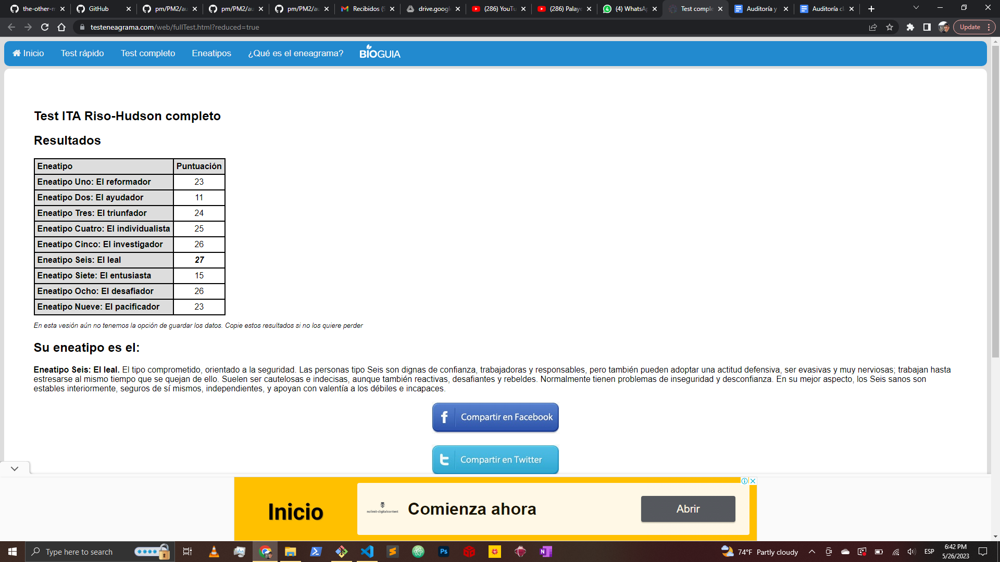
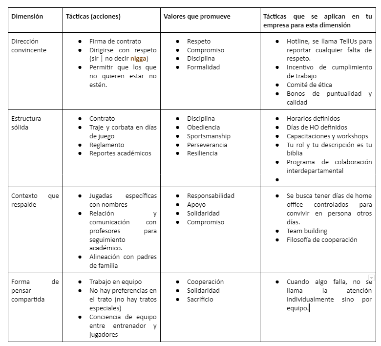

---
title: "Herramientas Sistémicas para la Dirección"
author: [Mariana Ávalos Arce]
date: "2023"
keywords: [Markdown, Example]
...

# Notas World Cafe (23/05/23)

1. ¿qué descubrimientos tuve de mi persona?

La flojera y mi sueño me ha afectado ultimamente

2. ¿Cuál fue mi experiencia en el proceso?

Interesante conocer a mis compañeros después de todo un año de estar con ellos

3. ¿Qué me llevo de esta actividad?

Proponer soluciones a veces es más fácil de lo que los problemas me parecen. Grandes problemas a veces tienen pequeñas soluciones.

4. Observaciones o comentarios a las rondas

A veces no conocía la cara de las personas. Uno siempre voltea al pizarrón y no tanto a la cara de mis compañeros que están más lejos.

# Notas Test Eneagrama (26/05/23)

**Eneatipo Seis: El leal**

El tipo comprometido, orientado a la seguridad. Las personas tipo Seis son dignas de confianza, trabajadoras y responsables, pero también pueden adoptar una actitud defensiva, ser evasivas y muy nerviosas; trabajan hasta estresarse al mismo tiempo que se quejan de ello. Suelen ser cautelosas e indecisas, aunque también reactivas, desafiantes y rebeldes. Normalmente tienen problemas de inseguridad y desconfianza. En su mejor aspecto, los Seis sanos son estables interiormente, seguros de sí mismos, independientes, y apoyan con valentía a los débiles e incapaces.

## Reflexión equipos de trabajo

- Cómo me gusta que sea el ambiente de trabajo? Con gente que es experta en el área, callado, enfocado.

- Cómo me gusta que me den instrucciones? que sean enfocadas a mi puesto, como orden y no como favor. Directo y a la cabeza.

## Qué impacto tienen la personalidad y el estilo de pensamiento en las habilidades directivas?

- Decidir con estrategia en qué parte puedes impactar de forma positiva

- Asignar tareas según la personalidad y estilo

- Responsabilidades más acertadas a su persona

- Llegar a las personas por igual.

- Complementarte con tu equipo de trabajo.

# Notas (27/05/23)

Getsstionar es en esencia sacarle todo el partido posible a lo que ya se tiene o se puede disponer.

Liderar es ir más lejos, es sustenatr una dinámica más rica y creadora con la organización y con el grupo. Es implicar, crear colaboración, buscar la satisfacción de los miembros, innovar.

- No son las circunstancias los que hacen felices a las personas, sino sus ideales.

## Coach Carter

- **Focusing on yourself**: cuando renuncia después de que la directora lo obliga a abrir el gym, ya que toma en cuenta su dignidad. cuando decide tomar el trabajo, y cuando los regaña en el camión.

- **Focusing on others**: contratos firmados, y Mr. Battle puede volver al equipo cuando se lo pide.

- **Focusing on the wider world**: cuando establece la regla del promedio de 2.3, labor social en la comunidad.

