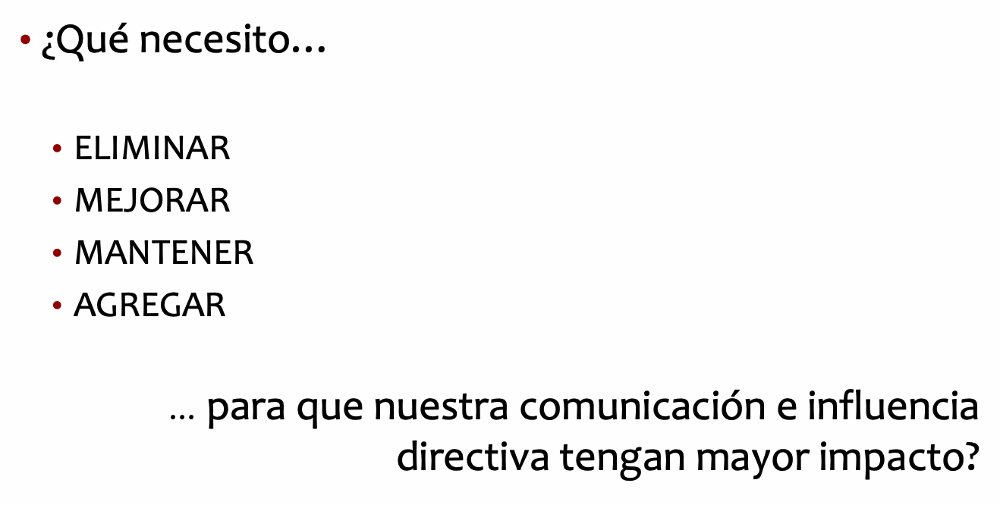
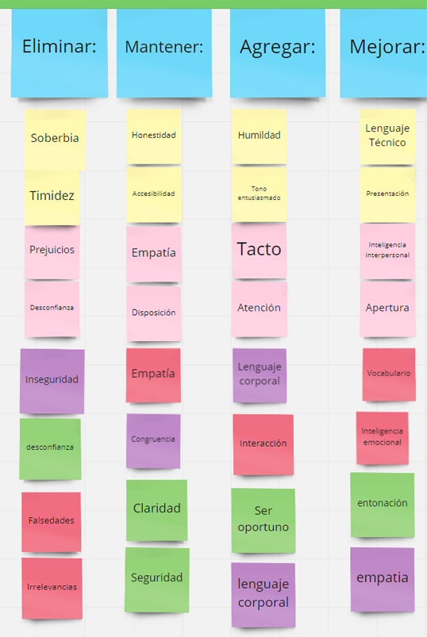

---
title: "Ética y Habilidades Directivas"
author: [Mariana Ávalos Arce]
date: "2021"
keywords: [Markdown, Example]
...

# Clase 08/10/2021

## Comunicación Efectiva

Es aquella que logra un fin.

### 3T's

- Tono

- Tino

- Tacto

### 3M's

- Modo

- Motivo: si lo que digo es para que me vean (alimentar mi ego) o para aportar realmente.

- Momento

## Gustavo Dudamel

1. Apasionado

2. Empático

3. Natural

4. No autoritario

5. Transparente

## Dirigir Requiere

1. Apertura de mente

2. Firmeza de criterio

## Proyecto Emma

## Actividad

