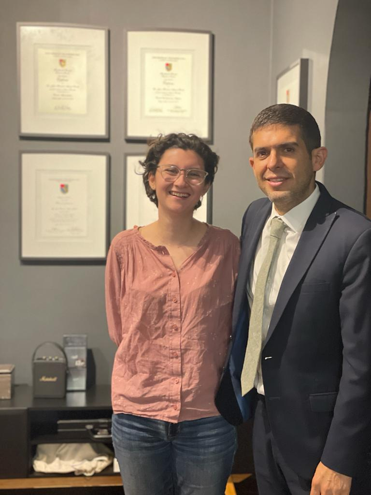

# Guía de preguntas para investigación

Nombre, experiencia directiva. Nombre de la empresa, puesto, tiempo en el puesto, número de
personas a su cargo.

- Nombre: Francisco Ascencio, Abogado por la Universidad de Guadalajara y Maestro en Derecho Público por la Universidad Panamericana.

    - Dato curioso: ha sido, por ocho años seguidos, el padrino de generación de la carrera de Derecho en el ITESO. Esto me hizo pensar que tiene cierta manera de conectar con las personas que lo hace muy especial.

- Experiencia directiva: socio fundador de 2 despachos: Vaertis Abogados, Abogados AM, profesor titular de Derecho Procesal Laboral en el ITESO, director del área de Derecho Laboral en el ITESO, además de ex Procurador General de la Defensa del Trabajo en el Estado de Jalisco.

- Puesto: Procurador General de la Defensa del Trabajo en el Estado de Jalisco

- Empresa: Procuraduría de la Defensa del Trabajo en el Estado de Jalisco

- Tiempo en el puesto: 7 años (2006-2013)

- Número de personas a su cargo: 74. Debajo de mi cargo, estaba el Subprocurador General, después seguían los Procuradores Auxiliares divididos en tres áreas: Litigios, Conciliación y Asesoría; de esas tres áreas, se juntaban 73 personas además del Subprocurador, que dependían de mis decisiones. 

# ÁREA PERSONAL

## 1. Para usted, ¿qué es la ética? ¿qué es dirigir?

Yo creo que la Ética respecto a la dirección, le llamaría yo Ética Directiva, es el deber ser, el deber actuar, conforme a los parámetros morales y sociales de lo esperado en un puesto del que se derivan otros. Cuando hablamos de Ética, intervienen valores morales, cuestiones subjetivas, de orientación sexual, religiosa y política, lo que hace que los éstandares éticos varíen; incluso dentro un país, estado, ciudad, existen distintos valores éticos. Yo creo que entonces la ética va orientada a lo que espera la sociedad respecto al deber ser: los estándares éticos cambian de acuerdo a la sociedad.

## 2. ¿Qué relación tiene la ética con la ciencia de datos?

A pesar de que en mi profesión no laboro explícitamente con la ciencia de datos, en la Procuraduría existía un área de análisis, donde básicamente se llevaban a cargo sensos o registros de cuánto duró cierto trámite, cierto juicio, abogados encargados, sus dependencias, etcétera; entonces por eso conozco un poco de lo que trata. Esta área siempre tuvo problema al realizar los registros con los abogados que venían a hacer algún trámite porque siempre estaban muy preocupados con su privacidad y qué se iba a hacer con aquellos datos que estábamos recaudando, lo cual se ha presentado siempre en todo el mundo: la gente se preocupa porque no sabe si sus datos brindan un acceso a su privacidad. Entonces, yo diría que la ética se relaciona con la ciencia de datos en cuanto a que debe ser aquello que nos dirija cuando tratamos con la privacidad de otros. 

Ahora, ¿ética y privacidad? Lo que tú puedes generar para ti mismo, no tiene ética. Tu privacidad y lo que realices dentro de la misma, no es un ámbito donde exista Ética. O sea, no podrías tenerte, hacia ti mismo, valores éticos. Y hacia el exterior, hacia la privacidad de los otros o la de uno mismo conviviendo en sociedad, va enfocado a un tema de creencia, y al externar la privacidad de uno mismo o de otros parcial o totalmente, involucra un razonamiento social, lo cual ya implica una ética: un valor entendido de reflejo, y al ser un reflejo, debe uno como ser humano cuidar que lo que se expresa de uno mismo o de otros sea apegado a la realidad. Ese cuidar, ese deber de reflejar realmente, es la ética actuando en la privacidad manifestada de uno mismo o de otros. A diferencia de la privacidad vivida por cada persona sin interactuar con la sociedad, donde lo que se hace por uno mismo es creencia, no es éticamente evaluado. La Ética siempre es un valor emergente de lo que espera la sociedad, no un valor personal. No debiera haber ética en la privacidad, ya que no existe un valor ético si la persona está aislada de la sociedad, si está en su privacidad.

En todo esto de los datos personales de otra persona, ya hablamos de Ética, privacidad y transparencia: ¿cómo debo ser transparente como persona física o moral?, y ¿y cómo es que tengo que guardar un tema de privacidad? Hay cosas en las que tengo que ser transparente y hay cosas en las que tengo que ser privado. Y esta decisión entre transparencia y privacidad tienen un corte ético.

## 3. Si hubiera que definir una metodología para la toma de decisiones, con base en su experiencia, ¿cuál sería? 

Como te decía cuando definíamos la Ética desde la óptica del puesto, es lo esperado que la sociedad implica a un puesto. Yo creo que la métrica que yo utilicé en la oportunidad de ese puesto, es ese deber ser, enfocado a una ética personal.

1. Tener en mente ese deber ser, enfocada a una ética esperada y a una ética personal.

2. Convencimiento personal de la cuestión.

3. Estandarizar procesos para organizar las decisiones, a razón de un ética personal a proyectar, para que los puestos que dependen de ti, actúen de forma coherente con lo que uno hace como directivo. Y ésta parte fue la que más me costó: yo llegué a esta dependencia, que era gratuita hacia el público, y con los datos que recaudaba el área de Análisis, me di cuenta que a la gente que llegaba le cobraban por darle los servicios con tal de que los empleados obtuvieran un beneficio económico - una mordida -, por un servicio que naturalmente debía ser gratuito, donde el empleado pedía la mordida prometiendo que el servicio se le iba a dar más rápido. Llegué entonces a poner un estándar de calidad: los empleados no pueden cobrar, es decir, un anticoyotaje que involucraba denuncia si se presentaba. Esto surgía de un convencimiento propio. Inmediatamente al año siguiente, busqué la forma de establecer una certificación de calidad que se debía cumplir por mandato institucional, que fue la certificación ISO 9001-2008. Así, estandaricé los procesos conforme esta norma para lograr que jamás pudieran salirse de los estándares de tiempo de atención, de tiempo de conciliación, de tiempo de duración de juicio, de asesoría, y que no se volviera a dar esta corrupción, porque mi valor ético probablemente estaba enfocado a la erradicación de la corrupción.

Me corrieron el 1 de marzo de 2013, y ese día llegó una persona diciéndome: "esas certificaciones son de restauranteros, aquí las cosas se van a hacer como digo yo", y comenzaron de nuevo con las mordidas. Lo trámites con la certificación estaban obligados a durar máximo 14 días, y ahora con el nuevo Procurador duraron hasta 2 o 3 meses. El tiempo en brindar una asesoría era de 4 días con la certificiación, pero se volvieron tramos de 26 meses de espera si no había mordida. Ahí se vio mi ética versus la ética de esa persona. Y me da mucha emoción, que cuando volvemos, siempre hay algún servidor público que me dice: "extrañamos cómo era el trabajo contigo: a pesar de que era un hijo de la &#%!, era muy cuadrado y exageradamente organizado".

# ÁREA TÉCNICA

## 4. ¿Cuáles son los principales retos a los que se ha enfrentado en su trayectoria directiva?

Mi mayor reto directivo ha sido: que las cosas funcionen como yo quiero que funcionen. Hacer que las personas, hacer que los bienes, que los servicios, funcionen como yo quiero que funcionen en todo momento, siempre. Es efectivamente cierto grado imposición, y siempre piensa uno: yo quisiera que mi empresa fuera como en Google, que la gente juego voleyball, ping pong, y mágicamente cae el dinero. Pero un despacho de abogados no puede ser así, porque no hay un tema de creatividad que mueve el proceso.

## 5. ¿Cuáles son las habilidades necesarias para dirigir correctamente?

Como te mencioné cuando definíamos la ética en la transparencia: la habilidad, o en este sentido, la sensibilidad para que a pesar de que aislado, o en privacidad, no exista una ética que nos evalúe, cada persona se guíe por creencias donde lo que quiere que se haga, es lo mejor para todos. 

Sin embargo, me acuerdo mucho de una abogada que tuve trabajando aquí hace no mucho, que decidió incluso dedicarse a otro rubro completamente diferente, a raíz de que le tocó un día despedir de una empresa cliente a una mujer porque estaba embarazada. Me dijo que no podía soportar haber formado parte de tal injusticia, y decidió renunciar y dedicarse al diseño de interiores. Este caso se me vino a la mente, porque para dirigir y ser una persona ética uno siempre decide qué es lo más justo para todos. Pero hay que recordar que la justicia es subjetiva: ella no sabía que aquella mujer embarazada había entrado a esta empresa hacía dos semanas, buscando una empresa que le diera un periodo de embarazo pagado, para después salirse y volver a su antigua empresa. La justicia se vuelve subjetiva, ya que depende de la perspectiva de la situación. Pero entonces, lo que uno debe de hacer como profesionista, y en mayor medida como profesionista a cargo, es siempre avanzar hacia lo que implique un avance de mi profesión: si ustedes como ingenieros en sistemas, se enfrazcan en definir qué es ético y qué no es, su profesión no avanza, no se cumple su finalidad para la cual fue hecha, y así con todas las profesiones. La justicia siempre va a ser subjetiva porque no tenemos absolutamente todas las perspectivas, así que lo importante es buscar la plenitud de la profesión, donde muchas veces es brindar un servicio a tu cliente. Las profesiones son ciencia, e invariablemente pienso que si persigues la plenitud de la misma, harás lo mejor para todos.

## 6. ¿Cuáles son los errores frecuentes que se pueden cometer en la dirección?

El error más frecuente es no aceptar cuando te equivocas en las decisiones. O sea si ves que el barco se está hundiendo, y tu te empeñas a ir llevándolo al mismo lugar que has estado yendo, el error es no aceptar que existe un error, o que es necesario un cambio. Hay que reinvertarse constantemente.

## 7. ¿Qué es el fracaso para usted y cómo lo ha enfrentado?

Es un tema que cuesta trabajo, pero yo en lo particular tengo un problema grande, que te lo pueden decir todos aquí en el despacho: no soy rencoroso, y las cosas se me olvidan rapidísimo. Sigo una ideología de: tragos gordos y adelante. Me enfoco en cómo solucionar el error, no en como estancarme en el error. El pproblema del fracaso no es el error en sí, sino estancarse en el error. No debe uno darse el tiempo para estancarse o lamentarse, porque se vuelve un problema. Si me llega a dar cáncer, no va a ser de remordimiento. 

## 8. ¿Qué herramientas o instrumentos se utilizan en su empresa para cuidar que se practique la ética?

En la Procuraduría se maneja por certificaciones de estándares de calidad, donde se estipulan qué acciones tomar siempre y en todo lugar. Tmabién un instrumento, tal vez no formalizado pero que está efectivamente presente en la ética de la empresa, es la retroalimentación que siempre llega a los oídos de la empresa, ya sea por medio del área de análisis, por ejemplo, o por situaciones más informales.

## 9. En el personal, ¿Cuáles le ha funcionado mejor y por qué?

Yo diría que la estandarización de procesos es una parte fundamental para que como director se tenga un impacto real cuando tu cargo dirige áreas que están incluso en otro municipio o en otra parte del mundo, ya que son un medio por el cual se formaliza la orientación de pensamiento de un director. También la constante supervisión, de forma presencial pues, de los detalles: a mí me encantaba pasar por los escritorios y checar la punta de los lápices con los que escribían los servidores públicos, y si no tenía bien sacada la punta, les rompía la punta para que lo hicieran de nuevo. Parecía yo un loco, pero esos lápices son los que se usaban para escribir indicaciones en los documentos para otras áreas, y si la punta no estaba fina, yo  no iba a entender nada de lo que escribieran, por ejemplo, entonces ¿quién les iba a entender?

## 10. ¿Qué desafíos éticos conoce relacionados a la ciencia de datos?

Va de la mano con la pregunta que me hiciste de la habilidad para dirigir correctamente: llevar el valor etico a la vida personal. De esta manera, cuando se presenta alguna oportunidad donde podrías decidir ser transparente en lugar de privado en cuanto a datos personales se refiere, el criterio se inclinará por la privacidad de la persona.

## 11. ¿Qué habilidades directivas considera más importantes desarrollar para ejercer la ética en la ciencia de datos?

La misma habilidad que mencioné para dirigir correctamente: llevar el valor ético a la vida personal, ya que como director de alguna empresa u órgano institucional donde invariablemente existe una rama de personal dedicada al análisis de datos, el puesto se te fue dado - o debió ser dado - por tu persona y lo que traes a la mesa de esa empresa. Al tener valores éticos arraigados incluso en tu vida personal, es más difícil que como instinto o de forma desapercibida te guíes por estropear la privacidad de alguien por elegir algún beneficio personal, porque entonces no es benficio personal: una persona ética consideraría pisotear a los demás más como un daño, que como beneficio.

## 12. ¿Tiene algún modelo o ejemplo de director que le inspire en su acción? ¿Quién? ¿Por qué?

No sigo un modelo o a alguna persona del rubro, si a eso te refieres. Pero en mi corazón, me inspira mucho mi papá. Él era arquitecto, y no lo considero como esta figura patriarcal intocable e intachable, sino que lo que me inspira de él es que murió feliz, y creo que es una idea que constantemente tengo con cada acción que hago. Y podrías decirme: pues robar y robar podría hacerte muy feliz, pero creo que el ser humano tiene distintos tipos de felicidad, donde uno de ellos es la plenitud en valores.

# GENERAL

## Con su experiencia, ¿qué recomendación nos da a quienes nos formarnos en habilidades directivas y la ética aplicada en la ciencia de datos? 

Lo primero que cualquier persona debe hacer para una ética arraigada y educada, creo que es leer el libro de Aristóteles de Ética a Nicómaco, que me encanta y esta entrevista toca temas del libro. Más de forma general, es preguntarse y reflexionar: ¿qué es lo que mi profesión espera de mí? ¿cuál sería la plenitud de mi profesión? para no distraernos en perspectivas que se van muy lejos cuando tenemos un dilema ético.

----

# Plan de Acción de Desarrollo Personal

1. Leer Ética a Nicómaco, para educar mis posturas. A pesar de que Aristóteles tiene opiniones con las que no concuerdo, como me dijo Francisco, "lo que vale la pena de un libro no es quien lo escribió, sino las partes que lo hacen a uno reflexionar".

2. Reflexionar el fin para el cual la Ingeniería en Sistemas fue acuñada. Para ello, consultar entrevistas con gente como Linus Torvalds, Alan Turing o incluso Richard Feynman, para llegar a una conclusión de lo que implica cumplir la plenitud de mi profesión.

3. Leer el Espíritu de las leyes de Montesquieu, para ver la naturaleza del contrato social que un individuo "firma" para acordar su comportamiento en sociedad. Esta entrevista me recordó este punto que había visto en algún momento hace años, pero nunca me he dado el tiempo de investigar esta sección del libro, y suena a algo que daría forma a mi ética en sociedad.

4. Reorganizar mi espacio de trabajo con cosas que me inspiren. Francisco, ya más en una plática personal, me dijo que leyó un artículo que decía que el espacio donde uno trabaja debe tener artefactos físicos que lo inspiren, ya que estos detalles controlan las emociones y nivelan nuestra actitud al trabajar. Cosas como fotos, cuadros, e incluso papeles sueltos que nos recuerden momentos agradables dentro o fuera de nuestro trabajo.

# APRENDIZAJES

Mis aprendizajes fueron muy concretos al salir de esta entrevista: 

- Lo que más me marcó fue lo que me dijo Francisco repsecto a las profesiones: para tener un caminar ético a lo largo de la vida laboral, hay que siempre tener presente qué sería la plenitud de mi profesión, y siempre enfocarse en cumplirla. Aplicado a mi particular porfesión como Ingeniera en Sistemas, me hizo pensar que muchas veces nos distraemos en cuánto nos pagan, si nos da estatus social, y nos olvidamos de que su fin es facilitar el avance de las ciencias, por medio del uso de estas calculadoras poderosísimas que conocemos como computadoras. Hacer las cosas "por el bien de la ciencia" es algo que se me vino a la mente cuando me habló de ese tema, y con lo que me he quedado pensando desde que lo vi para la entrevista. 

- También una conclusión es que la transparencia total aveces puede perjudicar la privacidad de los demás, por lo que no siempre la transparencia es una solución para todo dilema. 

- Un punto que toca Francisco me recordó mucho a lo que vimos en clase de "siempre buscar tener todas las perspectivas en mente para un dilema ético", ya que Francisco me contó de este caso donde despidieron a una mujer sólo por estar embarazada, pero que el dilema se volvía más gris cuando se conoció la intención de esta empleada, a lo que Francsico concluye que la justicia es siempre subjetiva, por más que intentemos que sea un tema universal. Por lo que tener la mayor cantidad de perspectivas es lo que nos va a guiar hacia decisiones éticas que no afecten el fin de nuestra profesión ni el bien de los demás.