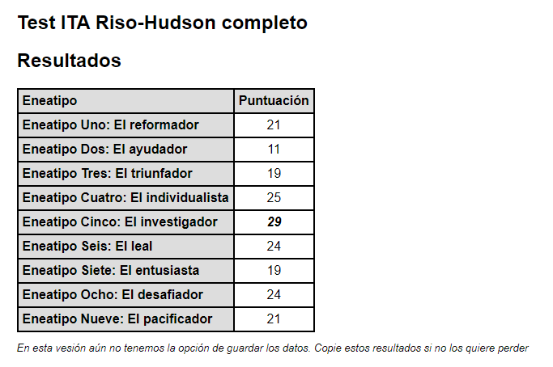

---
title: "Ética y Habilidades Directivas"
author: [Mariana Ávalos Arce]
date: "2021"
keywords: [Markdown, Example]
...

# Actividad: Test del eneagrama

## Mis resultados

1. El investigador

El tipo vehemente y cerebral. Los Cinco son despabilados, perspicaces y curiosos. Son capaces de concentrarse y enfocar la atención en desarrollar ideas y habilidades complejas. Independientes e innovadores, es posible que se obsesionen con sus pensamientos y elaboraciones imaginarias. Se desligan de las cosas, pero son muy nerviosos y vehementes. Por lo general tienen problemas de aislamiento, excentricidad y nihilismo. En su mejor aspecto, el Cinco sano es pionero visionario, suele estar en la vanguardia y es capaz de ver el mundo de un modo totalmente nuevo.

2. El individualista

El tipo romántico e introspectivo. Los tipos Cuatro son conscientes de sí mismos, sensibles, reservados y callados. Son demostrativos, sinceros y personales emocionalmente, pero también pueden ser caprichosos y tímidos. Se ocultan de los demás porque se sienten vulnerables o defectuosos, pero también pueden sentirse desdeñosos y ajenos a las formas normales de vivir. Normalmente tienen problemas de autocomplacencia y autocompasión. En su mejor aspecto, los tipos Cuatro sanos son inspirados y muy creativos, capaces de renovarse y transformar sus experiencias.

3. El desafiador

El tipo poderoso y dominante. Las personas tipo Ocho son seguras de sí mismas, fuertes y capaces de imponerse. Protectoras, ingeniosas y decididas, también resultan orgullosas y dominantes; piensan que deben estar al mando de su entorno y suelen volverse retadoras e intimidadoras. Normalmente tienen problemas para intimar con los demás. En su mejor aspecto, los Ocho sanos se controlan, usan su fuerza para mejorar la vida de otras personas, volviéndose heroicos, magnánimos y a veces históricamente grandiosos.