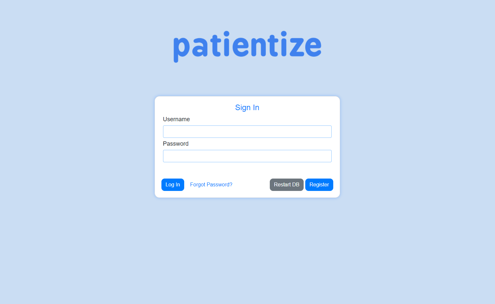
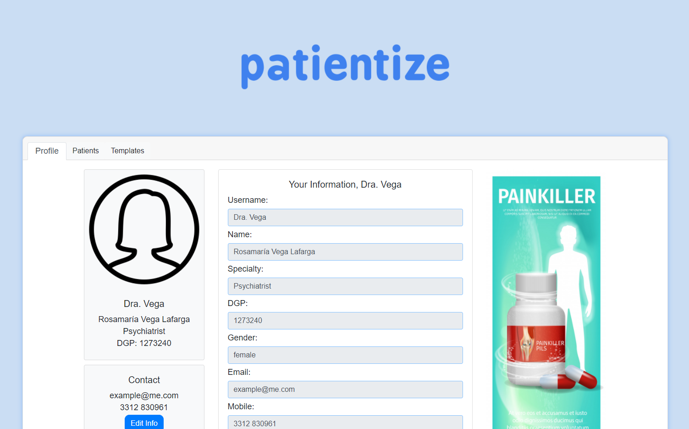

---
title: "Plan de calidad"
author: [Mariana Ávalos Arce]
date: "2022"
keywords: [Markdown, Example]
...

# Plan de Calidad

## Índice

1. [**Política**](https://github.com/the-other-mariana/pm/tree/master/PM1/project-planning/week4/res#1-pol%C3%ADtica)

2. [**Métricas**](https://github.com/the-other-mariana/pm/tree/master/PM1/project-planning/week4/res#2-m%C3%A9tricas)

    [**2.1 Funcionalidad Externa**](https://github.com/the-other-mariana/pm/tree/master/PM1/project-planning/week4/res#21-funcionalidad-externa)

    [2.1.1 Aspecto](https://github.com/the-other-mariana/pm/tree/master/PM1/project-planning/week4/res#211-aspecto)

    [2.1.2 Métricas](https://github.com/the-other-mariana/pm/tree/master/PM1/project-planning/week4/res#212-m%C3%A9tricas)

    [**2.2 Funcionamiento Interno**](https://github.com/the-other-mariana/pm/tree/master/PM1/project-planning/week4/res#22-funcionamiento-interno)

    [2.2.1. Métricas](https://github.com/the-other-mariana/pm/tree/master/PM1/project-planning/week4/res#221-m%C3%A9tricas)

    [**2.3 Pruebas**](https://github.com/the-other-mariana/pm/tree/master/PM1/project-planning/week4/res#23-pruebas)

3. [**Herramientas de Calidad**](https://github.com/the-other-mariana/pm/tree/master/PM1/project-planning/week4/res#3-herramientas-de-calidad)

    [3.1 Listas de Verificación](https://github.com/the-other-mariana/pm/tree/master/PM1/project-planning/week4/res#31-listas-de-verificaci%C3%B3n)

    [3.2 Formatos y/o Plantillas](https://github.com/the-other-mariana/pm/tree/master/PM1/project-planning/week4/res#32-formatos-yo-plantillas)

4. [**Métodos de Medición**](https://github.com/the-other-mariana/pm/tree/master/PM1/project-planning/week4/res#4-m%C3%A9todos-de-medici%C3%B3n)

5. [**Inspecciones y Auditorías**](https://github.com/the-other-mariana/pm/tree/master/PM1/project-planning/week4/res#5-inspecciones-y-auditor%C3%ADas)

6. [**Responsables**](https://github.com/the-other-mariana/pm/tree/master/PM1/project-planning/week4/res#6-responsables)

7. [**Procedimientos: Situaciones fuera de control**](https://github.com/the-other-mariana/pm/tree/master/PM1/project-planning/week4/res#7-procedimientos-situaciones-fuera-de-control)

## 1. Política

Estamos comprometidos a proveer una solución web de alta calidad, mantenible, escalable y segura por naturaleza, para todos los médicos del mundo que deseen manejar la información de su trabajo en un entorno digital sencillo y fácil de entender.

## 2. Métricas

Lo que describe a un software a grandes rasgos es: ¿Cómo se ve? y ¿Cómo funciona? A continuación, se presentan las métricas para controlar la calidad de la solución web.

### 2.1 Funcionalidad Externa

Las capturas de pantalla que se muestran a continuación es una vista preliminar en cuanto a estética y colores (puede cambiar), además el nombre está sugjeto a cambios. Los botones y proporciones sí son los requeridos. Cada sección posee una tabla llamada *Unit Test(s)* que indican la funcionalidad requerida de la pantalla presentada y sus criterios de aceptación.

#### 2.1.1 Aspecto

1. Login

La página cuenta con la vista usual de un login.

Unit Test(s)

| Caso | Criterio de aceptación |
| --- | --- |
| Constraseña y Usuario ingresados existen en la base de datos | Entra a la pestaña de Perfil |
| Usuario existente, pero contraseña ingresada erróneamente | Mensaje de error. El sistema se queda en Login |

2. Registro

Cuando el usuario entra por primera vez y da click en el botón *Register* de la pantalla principal, se mostrará una pantalla para crear una cuenta, donde los datos obligatorios están encuadrados de rojo: Username y Password. Si al dar click en *Register* y el usuario que desea crear ya existe, se mostrará un letrero de error en rojo debajo del cuadro principal de registro.

Unit Test(s)

| Caso | Criterio de aceptación |
| --- | --- |
| Usuario y contraseña son ingresados solamente, el usuario aún no existe en la base de datos | El sistema carga la pantalla de Login y guarda el usuario registrado |
| Usuario y contraseña son ingresados solamente, usuario existe ya en la base datos | Mensaje de error: el usuario ya existe. Carga de nuevo página de registro |
| Sólo se ingresa el usuario | Mensaje de error: para crear un usuario se necesita mínimo el Usuario y Contraseña. |

2. Perfil

Después de que un usuario **exitente** se loggea, se observa la pantalla con el resumen de su perfil.

Unit Test(s)

| Caso | Criterio de aceptación |
| --- | --- |
| Usuario y contraseña son ingresados correctamente en Login | La pestaña Profile muestra los datos principales del usuario correspondiente. |

3. Templates

La página permite que el usuario personalice los formularios que usa frecuentemente con sus pacientes. Este proceso comienza en la pestaña de Templates.

Unit Test(s)

| Caso | Criterio de aceptación |
| --- | --- |
| Una vez loggeado, se da click en la pestaña Templates | La pestaña Temlates muestra todos los Templates guardados del usuario correspondiente. |

- Crear un Template

    Si estando en la página anterior se le da clic al botón de Add Template, lo que aparece es lo siguiente, invitando al usuario a primero titular su nuevo Template. Por ejemplo, *Dosis Change* (Cambio de dosis), para aquel médico que debe mantener un control sobre cuándo y por qué cambia la dosis en sus pacientes.

    

    Para añadir un campo personalizado a un Template, se da clic en el botón de *Add Field*. Después, debe de nombrarse dicho campo y elegir el tipo de dato que almacenará: 

    - Fecha

    - Texto (una línea, tan larga como se desee)

    - Texto Largo (varias líneas, tan largas como se deseen)

    - Pregunta Sí/No

    Cuando se agrega un nuevo campo, el botón de *Add Field* se mueve de tal forma que siempre queda al final de todos los campos que se hayan seleccionado hasta el momento.

    Este proceso se repite tantas veces como se deseen campos en el Template. Adicionalmente, el usuario puede elegir un color para todos los templates de ese tipo, eligiendo un valor en la casilla cuadrada que muestra un color naranja en el ejemplo. Un Template 5 campos se vería de la siguiente manera:

    

    Al dar clic en *Save*, el Template queda guardado y está listo para usarse en pacientes.

    

    Unit Test(s)

    | Caso | Criterio de aceptación |
    | --- | --- |
    | Se da click en *Add Template* | Se despliega el modal de New Template sin ningún campo |
    | Se da click en *Add Field* por primera vez | Se acumula un campo entre el botón y el header |
    | Se da click en *Add Field* después de la 1a vez | Se acumulan N campos según N número de clicks en *Add Field* |
    | Se da click en *Dismiss* | El Template no se guarda en la base de datos. |
    | Se da click en *Save* con 0 campos | El Template se guarda vacío en la base de datos. |
    | Se da click en *Save* con N campos | El Template se guarda en la base datos del usuario correspondiente. |

- Usar el Template

    Cuando el usuario se mueva a la pestaña de Pacientes y de clic en *Add Patient*, un modal1 aparecerá sobre la pantalla con los campos a llenar:

    

    Este proceso se repetirá cuantas veces sean los pacientes que se tengan. La vista con la lista de los pacientes actuales se ve de la siguiente manera:

    

    El usuario, al poner el cursor **sobre** el nombre de algún paciente, y le dé click, se mostrará la vista de detalles del paciente: aquí es donde todos los Templates y documentos se resguardan por paciente. Por lo tanto, en la sección de *Medical Documents* aparecerá un botón naranja (color seleccionado en la sección anterior) que dice *Dosis Change*, que es el Template que se creó como ejemplo. Al dar click en este botón, el usuario ya puede llenar la información de los campos que seleccionó para su template y guardarlos como un documento en su paciente.

    

    Después de dar click en *Save*, un documento de *Dosis Change* se guarda en el paciente, donde la ficha es del color que eligió  en usuario para todas las fichas de tipo *Dosis Change*, con la finalidad de facilitar la búsqueda rápida de documentos.

    

    Unit Test(s)

    | Caso | Criterio de aceptación |
    | --- | --- |
    | Se da click en *Add Patient* | Aparece un modal con los 6 campos a llenar vacíos |
    | Se da click en *Add Patient* y luego *Dismiss* | Aparece un modal con los 6 campos a llenar vacíos, para después desaparecer sin cambios en la base de datos. |
    | Se da click en *Add Patient* y luego *Save* | Aparece un modal con los 6 campos a llenar vacíos, para después desaparecer haciendo cambios en la base de datos y mostrando el nuevo paciente en la lista. |
    | Se da click sobre el nombre de algún paciente | Aparece la pantalla de todo lo guardado para ese paciente. Los Templates deben aparecer como botones del color seleccionado. |
    | Se da click sobre el paciente pero no sobre el nombre | No sucede nada. |
    | Ya en el paciente, se da click sobre algún botón de Template | Se muestra un modal con los campos especificados previamente en blanco.
    | Ya en el paciente, se da click sobre algún botón de Template y después en *Save* | Se guarda como un documento en ese paciente, y se muestra en la lista con los datos capturados y en una ficha del color especificado, pero ligeramente más claro. |
    | Ya en el paciente, se da click sobre algún botón de Template y después en *Dismiss* | Desaparece el modal y no hay cambios en la base de datos. |
    | Ya en el paciente, se da click en *Delete* de algún documento guardado | Desaparece la ficha del documento sin alterar el orden de los demás documentos. |
    | En Templates, se da click en *Delete* | En la pestaña de algún paciente con uno / varios documento(s) guardado(s) usando el Template borrado, debe(n) seguir ahí. Sólo el botón del Template desparece. |

- Borrar un Template

    Supongamos que un usuario tiene el Template *Dosis Change* en morado y *Medicine Change* en azul. Al hacer click en el botón *Delete* en la esquina inferior derecha del Template *Medicine Change*, ese Template será borrado y ahora en cada paciente ya no estará disponible el botón azul de *Medicine Change*. Sin embargo, todos los documentos de tipo *Medicine Change* hasta el momento seguirán guardados en los pacientes que los posean.

    

    Unit Test(s)

    | Caso | Criterio de aceptación |
    | --- | --- |
    | Se da click en *Delete* de algún Template | Se vuelve a cargar la pestaña de Templates, donde el Template borrado ya no está en la lista. |

- Editar un Documento de algún Paciente

    Si el usuario se mueve a la vista de algún paciente, podrá elegir editar algún documento de ese paciente, haciendo click en la ficha que desee, en el botón gris *Edit* en la esquina inferior derecha. Aparecerá un modal1 sobre la vista actual con los datos previos de ese documento listos para editarse.

    

    Unit Test(s)

    | Caso | Criterio de aceptación |
    | --- | --- |
    | Se da click en *Edit* de algún Documento de algún paciente y se da click en *Save* | Se vuelve a cargar la pestaña del paciente, donde el Documento editado muestra los cambios hechos. Se actualiza la base de datos. |
    | Se da click en *Edit* de algún Documento de algún paciente y se da click en *Dismiss* | Se vuelve a cargar la pestaña del paciente, donde el Documento editado no muestra cambio alguno. |
    | Se da click en *Delete* de algún Documento de algún paciente | Se vuelve a cargar la pestaña del paciente, pero sin el Documento borrado en la lista. Se actualiza la base de datos. |  

4. Recuperar Constraseña

Si el usuario no recuerda su contraseña establecida en la sección [Registro](https://github.com/the-other-mariana/pm/tree/master/PM1/project-planning/week4/res#Registro), puede dar click en el link en azul que dice *Forgot Your Password?*, llevándolo a la siguiente pantalla:

Luego, si el usuario ingresa el correo electrónico que vinculó con su cuenta, y da click en el botón *Send*, se le enviará un correo electrónico con su contraseña:

En caso de algún error al enviar el correo, se mostrará la siguiente pantalla:

Si el usaurio da click en *Ok*, será redireccionado a la página principal.

Unit Test(s)

| Caso | Criterio de aceptación |
| --- | --- |
| Al cargar el Login, se da click en *Forgot Your Password?* | El sistema muestra la pantalla de Recuperar Constraseña |
| Después del Logout, se da click en *Forgot Your Password?* | El sistema muestra la pantalla de Recuperar Constraseña |
| Ingresar un email sin @ y dar click en *Send* | Mensaje de error: Something went wrong. Please make sure the email is correct. |

#### 2.1.2 Métricas

- Definición de Fallo

> Un fallo o defecto es inyectado en un software cuando un error ocurre en el proceso de desarrollo del sistema.

- Métricas de Calidad del Producto Final

    1. **Instrinsic Product Quality (IPQ) Metrics**: 
    
        1. **Defect Density Rate (DDR)**: es el número de bugs2 (Defectos Funcionales) que se registran al usar todas y cada una de las funcionalidades del sistema dividido entre el tamaño del sistema.

            $$
            DDR = \frac{\hbox{Número de bugs}}{LoC^3}
            $$

            Esta métrica deberá calcularse cada 5 bugs reportados, hasta que el software lleve 2 años de liberación.

        2. **Mean Time of Failure (MTTF)**: es la medida promedio de cuánto tiempo le toma al sistema fallar de forma fatal4. Se puede dividir este tiempo entre el tiempo total estimado sin fallas para obtener un porcentaje.

        Por cada *bug* encontrado, se deberá calcular:

        3. **Probability of Failure**: la probabilidad de fallo asociado a un bug presente *i*, también llamado *bug size*.

            $$
            PoF_i = \frac{\hbox{Caminos con bug en una funcionalidad}}{\hbox{Total de caminos de la funcionalidad}}
            $$

        Especificaciones:

        | Métrica | Fitness Function6 | Significado |
        | ---- | ---- | ---- |
        | DDR | DDR = 1 por cada 1000 LoC | Ideal o normal en software no trivial. |
        | MTTR | MTTR = 100% | El software debe evitar a toda costa fallos fatales. Un fallo fatal debe ser arreglado antes de la liberación | 
        | PoF | PoF > 50% | Bug severo, prioridad en seguimiento. |

    2. **Lines of Code Defect Rates**: 

        El LoC del sistema debe calcularse para el tamaño total del sistema, y cada que se calcule deberá reportarse como **LoC viejo (SSI)** y **LoC nuevo (CSI)**, refiriéndose al tamaño del sistema anterior y al tamaño después de la actualización más reciente: SSI por Shipped Source Instructions y CSI por Changed Source Instructions, ya que las LoC se miden por Source Instructions (instrucciones de código fuente).

        Reportar en cada *release*:

        - **SSI** y **CSI**.

        - **Defect Rate per Thousand SSI (KSSI)**:

        $$
        KSSI = \frac{bugs}{\hbox{Miles de SSI}}
        $$

        - **Defect Rate per Thousand CSI (KSSI)**:

        $$
        KCSI = \frac{bugs}{\hbox{Miles de CSI}}
        $$

        Y así calcular el **Número total de Defectos (DDR)**:

        $$
        DDR = KCSI \times KLoC
        $$

        Especificaciones:

        | Métrica | Fitness Function6 | Significado |
        | ---- | ---- | ---- |
        | KSSI | KSSI = 1 | Ideal o normal. Prioridad depende del *bug size*. |
        | KCSI | KCSI = 1 | Ideal o normal. Prioridad depende del *bug size*. |

    3. **Customer Problems Metrics**:

        Desde el punto de vista del usuario, todos los problemas con los que se encuentran mientras usan el sistema, no sólo los **defectos válidos** (bugs), son problemas con el software. Incluso los problemas de usabilidad, documentación imprecisa, etc. 

        Reportar:

        - **Problems per User in a Month (PUM)**: el PUM es calculado cada mes después de que el software es liberado para el uso del mercado o usuarios selectos.

        $$
        PUM = \frac{\hbox{Customer problems}}{\hbox{Meses de uso}}
        $$

        Especificaciones:

        | Métrica | Fitness Function6 | Significado |
        | ---- | ---- | ---- |
        | PUM | - | Considerar aquel PUM que no haga que el FBI salte a valores anormales. |

    4. **Defect Density During Testing**

        Las métricas de **DDR** aplicadas durante el proceso de desarrollo están correlacionadas positivamente con el DDR del release futuro.
        
        Reportar en cada *push*5 al código:

        $$
        DDR = \frac{\hbox{Número de bugs}}{LoC^3}
        $$

        Si el **DDR** durante el testing de desarrollo **es el mismo o menor que aquel DDR del release anterior**, entonces deberemos preguntarnos: ¿el testing para el release actual está deteriorando el producto futuro?

        Especificaciones:

        | Métrica | Fitness Function6 | Significado |
        | ---- | ---- | ---- |
        | DDR | DDR actual <= DDR anterior | Seguimiento. Registrar el patrón de defectos que llegan (nuevos) al código fuente para identificar los tiempos entre fallas, de forma que los patrones indiquen la calidad por área desarollada.  |

        El objetivo es buscar estabilizar la llegada de nuevos bugs en un **nivel bajo y constante.**

    5. **Metrics for Maintenance**

        Mantenimiento de software:

        > Cuando el desarrollo de un producto de software está completo y éste es liberado al mercado, entra a la fase de mantenimiento en su ciclo de vida.

        Reportar:

        - **Llegada de defectos en intervalo de tiempo**: registrar los nuevos defectos funcionales y no funcionales (customer problems) en una serie de tiempo.

        - **Fix Backlog Index (FBI)**: el *Fix Backlog* es el número de bugs que se deben de arreglar como parte del mantenimiento. El *Fix Backlog Index* es el número de problemas reportados que **quedan al final de 1 semana**. Hacer una serie de tiempo.

        - **Backlog Management Index (BMI)**: sirve para manejar el backlog de problemas aún abiertos y no resueltos.

        $$
        BMI = \frac{\hbox{Número de problemas cerrados en 1 semana}}{\hbox{Número de nuevos problemas detectados en 1 semana}} \times 100\%
        $$

        - **Fix Response Time (FRT)**: es el tiempo límite que debe pasar para que la solución de un error deba estar disponible al público, en función de la métrica **PoF** para cada error *i*. El **Fix Response Time Metric** es el promedio de todos estos tiempos límite. 

        Especificaciones:

        | Métrica | Fitness Function | Significado |
        | ---- | ---- | ---- |
        | FBI | FBI < Product Backlog Tasks | Los Fixes por hacer en la siguiente semana no deben sobrepasar el número de tareas por hacer en ese tiempo. |
        | BMI | BMI > 100 | El backlog está siendo reducido y se llegará a cero. |
        | BMI | BMI < 100 | El backlog está aumentando y el mantenimiento sólo incrementará.
        | BMI | BMI = 100 | El backlog de mantenimiento siempre es constante. Cada nueva semana hay que arreglar el mismo número de problemas. |
        | FRT | FRT pequeña (1 día) | Pequeños FRT conduce a satisfacción del cliente. |

        Realizar una serie de tiempo del BMI (gráfico de control).

### 2.2 Funcionamiento Interno

Se muestra a continuación una serie de métricas de arquitectura de software, las cuales son medidas estandarizadas que permitirán saber si un software es mantenible, escalable y *sano*, ya que si bien un software hace lo que debe de hacer, puede ser imposible de mantener y quedar obsoleto en poco tiempo. Además de la métrica, se presentan los rangos aceptados y no aceptados del producto con la métrica correspondiente.

#### 2.2.1 Métricas

Definición de Deuda Técnica:

> La deuda técnica (Technical Debt) es todo aquel trabajo que se está acumulando para el futuro.

- **Modularity Maturity Index (MMI)**: sirve para comparar la deuda técnica entre varias versiones de un software. La *Modularidad* es un principio introducido en los 70s donde se establece que un módulo en software debe contener sólo una función de diseño, es decir, un módulo debe ser un pedazo de código que se dedica a una sola tarea. Para calcular el MMI se evalúan los siguientes criterios:

1. Domain and Technical Modularization (25%)

    1. % de código fuente en Domain Modules (Módulos de dominio) con relación a LoC total.

    2. % de código fuente en Technical Layers (Capas Técnicas) con relación a LoC total.

    3. Relación de tamaño entre los módulos de dominio

        $$
        \frac{(\frac{\hbox{Domain LoC max}}{\hbox{Domain LoC min}})}{\hbox{Número de Domain Modules}}
        $$

    4. Relación de tamaño entre las capas técnicas

        $$
            \frac{(\frac{\hbox{Technical Layer LoC max}}{\hbox{Technical Layer LoC min}})}{\hbox{Número de Technical Layers}}
        $$

    5. Módulos de dominio, capas técnicas, packages y classes tienen una responsabilidad clara.

2. Interfaces Internas (10%)

    1. Modulos de dominio o técnicos tienen interfaces (% de violaciones).

    2. Mappeo de las interfaces internas usando packages / namespaces o projectos.

3. Proporciones (10%)

    1. % de código fuente en clases amplias.

    2. % de código fuente en métodos amplios.

    3. % de clases en packages largos.

    4. % de los métodos del sistema con gran Complejidad Ciclomática (Cyclomatic Complexity)

El MMI se obtiene determinando un número entre 0 y 10 para cada criterio. Los números obtenidos se suman por sección y se dividen entre el número de criterios sumados. El MMI se registra con el porcentaje del principio para que un solo número entre 0 y 10 sea determinado. Califique de la siguiente manera:

| Sección | 0 | 1 | 2 | 3 | 4 | 5 | 6 |
| --- | --- | --- | --- | --- | --- | --- | --- |
| 1.1 | <=54% | >54% | >58% | >62% | >66% | >70% | >74 |
| 1.2 | <=75% | >75% | >77,5% | >80% | >82,5% | >85% | >87 |
| 1.3 | >=7,5 | <7,5 | <5 | <3,5 | <2,5 | <2 | <1,5 |
| 1.4 | >=16,5 | <16,5 | <11 | <7,5 | <5 | <3,5 | <2,5 |
| 1.5 | No | partially | Yes, all |
| 2.1 | >=6,5% | <6,5% | <4% | <2,5% | <1,5% | <1% | <0,6 |
| 2.2 | No | partially | Yes |
| 3.1 | >=23% | <23% | <18% | <13,5% | <10,5% | <8% | <6% |
| 3.2 | >=23% | <23% | <18% | <13,5% | <10,5% | <8% | <6% |
| 3.3 | >=23% | <23% | <18% | <13,5% | <10,5% | <8% | <6% |
| 3.4 | >=3,6% | <3,6% | <2,6% | <1,9% | <1,4% | <1% | <0,7 |

Después de obtener el MMI, se verifica su significado:

| Métrica | Fitness Function | Significado |
| ---- | ---- | ---- |
| MMI | 8 <= MMI <= 10 | Baja deuda técnica. Ideal. |
| MMI | 4 <= MMI < 8 | Moderada deuda técnica. |
| MMI | 0 <= MMI < 4 | Alta deuda técnica. Su mantenimiento se hará con gran esfuerzo. Debe considerarse hacer un *upgrade* o reemplazar la totalidad del sistema. |

- **Circular Dependency**: también llamada **cyclic dependecy**, es un antipatrón: indica las dependencias que tiene un archivo de código fuente con los demás archivos. Si un desarrollador quiere usar un archivo, todos aquellos archivos de los que depende también serán usados, por lo que se incrementa el desperdicio. Un grupo ciclado de archivos fuente se vería así:

- **Número de elementos en el grupo ciclado más grande (MaxCG)**:

| Métrica | Fitness Function | Significado |
| ---- | ---- | ---- |
| MaxCG | MaxCG = 0 | No existen ciclos de dpendencias. Ideal. |
| MaxCG | 0 < MaxCG <= 5 | Ciclos de dependencias normales o aceptables. |
| MaxCG | MaxCG > 5 | El test de Cycle Groups debe fallar. Dar seguimiento. |

- **Average Component Dependency (ACD)**: esta métrica dice, si seleccionamos un archivo fuente / módulo, sobre cuántos elementos depende, incluyéndose a sí mismo. Si $x_i$ es el número de dependencias de un componente (archivo fuente / módulo) y $N$ es el número de componentes del sistema,

$$
ACD = \frac{\sum_{i = 1}^{i = N}{x_i} }{N}
$$

Por ejemplo, de tener un sistema con 6 componentes (archivos fuente / módulos), y calcular el ACD para la caja con el número 4, el resultado sería 6.

- **Propagation Cost Metric (PC)**: 

$$
PC = \frac{ACD}{N} \times 100\%
$$

Nos indica que cada que toquemos un archivo fuente / módulo $x_i$, el $PC$% de todos los componentes del sistema están siendo afectados en promedio.

Especificaciones:

| Métrica | Fitness Function | Significado |
| ---- | ---- | ---- |
| PC | PC >= 10% | Si N >= 5000, el PC es riesgoso. Seguimiento. |
| PC | 0 <= PC <= 100% | Si N < 500, aunque PC sea alto, no es problema. |

- **Size Metrics**:

Especificaciones:

| Métrica | Fitness Function | Significado |
| ---- | ---- | ---- |
| LoC por archivo | 1 <= LoC <= 800 | Tamaño recomendado. |
| Número de isntrucciones (I) |  1 <= I <= 100 | Tamaño recomendable por método o función. |
| Complejidad Ciclomática (CC) | CC > 24 | Cantidad total de caminos de ejecución posibles en un método. Es el número de casos de prueba mínimos. Mayor a 24 significa riesgo a errores. |
| Profundidad de identación (PI) | PI > 4 | Número maximo de identación en un método. Más de 4 significa complejidad innecesaria. |

### 2.3 Pruebas

1. Cada una de las Métricas descritas en la [sección 2.2](https://github.com/the-other-mariana/pm/tree/master/PM1/project-planning/week4/res#22-funcionamiento-interno) y [subsección 2.1.2](https://github.com/the-other-mariana/pm/tree/master/PM1/project-planning/week4/res#212-m%C3%A9tricas) debe de ser probada o calculada con la siguiente periodicidad:

| Métrica | Clasificación | Periodicidad | Etapa |
| --- | --- | --- | --- |
| DDR | Externo | Cada 5 bugs reportados, hasta que el software cumpla 2 años de liberación. | Liberación |
| MTTR | Externo | Cada prueba con el usuario final | Desarrollo |
| PoF | Externo | Cada que el DDR sea calculado, calcular el *bug size*. | Liberación |
| KSSI | Externo | Cada release al mercado. | Liberación |
| KCSI | Externo | Cada release al mercado a partir del segundo release. | Liberación | 
| PUM | Externo | Cada mes ya que sea liberado al mercado. | Liberación |
| DDR en Testing | Externo | Cada prueba con el usuario. | Desarrollo | 
| FBI, BMI, FRT | Externo | Cada semana durante el desarrollo. | Desarrollo |
| MMI, MaxCG, PC | Interno | Cada nuevo release, ya sea al público o cada sprint. | Ambas |
| LoC por archivo, I, CC, PI | Interno | Cada sprint. | Desarrollo |

2. Cada uno de los puntos descritos en la [sección 2.1.1](https://github.com/the-other-mariana/pm/tree/master/PM1/project-planning/week4/res#211-aspecto) debe ser probado con una serie de *Unit Tests* descritos en la parte inferior de cada pantalla en dicha sección para considerarse aceptado. Un *Unit Test* prueba cada módulo de código para comprobar que *funcione* correctamente como el usuario final espera. Son pruebas programadas o automatizadas que se hacen en cuanto una nueva funcionalidad es codificada.

3. Pruebas al final de cada sprint: 

    - Al final de cada sprint, se deberá hacer una prueba agendada con algún usuario final y/o socio fundador.

    - Durante la misma se le debe presentar al usuario la funcionalidad que se está probando y registrar defectos funcionales y no funcionales. 

    - Pruebas que no duren más de 30 min, a modo de taller. Probar únicamente el entregable de dicho sprint.

## 3. Herramientas de Calidad

### 3.1 Listas de verificación

Como se menciona en la seccion [sección 2.3 (Pruebas)](https://github.com/the-other-mariana/pm/tree/master/PM1/project-planning/week4/res#23-pruebas), se deberán registrar los defectos funcionales y no funcionales de cada prueba con el usuario final, al término del sprint. La siguiente [Hoja de Verificación](https://github.com/the-other-mariana/pm/blob/master/PM1/project-planning/week4/res/verif-list.md) será usada para dicho registro. Favor de dar clic en [**aquí**](https://github.com/the-other-mariana/pm/blob/master/PM1/project-planning/week4/res/verif-list.md) para ir a dicha Hoja.

### 3.2 Formatos y/o Plantillas

- Histogramas

    - Histograma de métrica MTTF a lo largo de los meses de desarrollo

    Ejemplo

    

- Gráficos de control

    - Gráfico de control para la métrica BMI

        - Límite de Control Central (LCC) = 100

        - Límite de Control Superior (LCS) = $LCC +(3 \times \sigma)$

        - Límite de Control Inferior (LCI) = $LCC -(3 \times \sigma)$

        - Formato:

        | Componente del gráfico | Especificaciones |
        | ---- | ---- |
        | Eje X | Como el BMI se calcula cada semana de desarrollo, el eje x será el tiempo $t$ por semana |
        | Eje Y | Valor del BMI de la semana $t_i$ correspondiente |
        | LCC | Línea continua |
        | LCS, LCI | Línea punteada |

    - Gráfico de control para la métrica FBI

        - Límite de Control Central (LCC) = $\overline{FBI}$

        - Límite de Control Superior (LCS) = $LCC +(3 \times \sigma)$

        - Límite de Control Inferior (LCI) = $LCC -(3 \times \sigma)$

        - Límite de Advertencia Superior (LAS) = $LCC +(2 \times \sigma)$

        - Límite de Advertencia Inferior (LAI) = $LCC -(2 \times \sigma)$

        - Formato:

        | Componente del gráfico | Especificaciones |
        | ---- | ---- |
        | Eje X | Como el FBI se calcula cada semana de desarrollo, el eje x será el tiempo $t$ por semana |
        | Eje Y | Valor del FBI de la semana $t_i$ correspondiente |
        | LCC | Línea continua |
        | LAS, LAI | Línea continua |
        | LCS, LCI | Línea punteada |

- Gráficos de dispersión

    - Gráfico de dispersión con las siguientes propiedades:

        - Formato:

        | Componente del gráfico | Especificaciones |
        | ---- | ---- |
        | Eje X | Periodo de tiempo de desarrollo por semanas $t$ |
        | Eje Y | Valor de la métrica MMI (0-10) |
        | Tamaño del punto | LoC |

    Ejemplo

    

## 4. Métodos de Medición

Los métodos para medir las métricas presentadas serán mayoritariamente *automatizados*, es decir, por medio de *scripts* que analicen las líneas de código y calculen dichas métricas y las reporten al archivo `metrics.txt`. Estos *scripts* involucrarán alguno de los siguientes:

- Lenguajes: Python o Shell

- Regular Expressions strings

- Git7:

    - Cada *push* al código fuente deberá llevar un comentario por parte del programador, que comience con `update:` si agregó código nuevo, `fix:` si solucionó algún *bug* o `docs:` si se trata de documentación. De esta forma, se podrán analizar las métricas presentadas por medio de *scripts*. 

Las formas de obtener las mediciones serán las siguientes para cada métrica:

| Métrica | Significado | Método de medición |
| --- | --- | --- |
| DDR | Defect Density Rate | Python script que ejecute el comando `git log \| grep '^(fix)'` y calcule el DDR con el LoC |
| MTTR | Mean Time To Failure | Manualmente, durante pruebas |
| PoF | Probability of Failure | Manualmente, de ser posible, para bugs con prioridad |
| KSSI | Defect Rate Per Thousand SSI | Python script que ejecute el comando `git log \| grep '^(fix)'` por cada 1K de líneas LoC del código fuente |
| KCSI | Defect Rate Per Thousand CSI | Python script que ejecute el comando `git log \| grep '^(fix)'` por cada 1K de líneas mostradas al ejecutar `git diff` (líneas cambiadas) |
| PUM | Problems per User in a Month | Python script que cuente el número de mensajes de users en el mes correspondiente | 
| FBI | Fix Backlog Index | Manualmente, con los post its que quedan al final de la semana |
| BMI | Backlog Management Index | Manualmente |
| FRT | Fix Response Time | Python script que ejecute el comando `git log \| grep '^(fix)'` y calcule las diferencias entre fechas |
| MMI | Modularity Maturity Index | Python script que calcula el % dados los archivos de código fuente |
| MaxCG | Maximum elements in Cycle Groups | Manualmente |
| PC | Propagation Cost | Python script que cuente `import` statements |
| LoC por archivo | Lines of Code | Comando `grep -ve '^\s*$' <file.js> \| wc -l  >> metrics.txt` |
| I | Número de Instrucciones por módulo | Python script |
| CC | Complejidad Ciclomática | Manualmente |
| PI | Profundidad de identación | Python script que cuente `\t` |

## 5. Inspecciones y Auditorías

- Los sprints tendrán, al final de cada uno, un Sprint Review donde se demostrará y validará el avance ante el Product Owner y el socio fundador. Este momento es distinto al de pruebas de usuario, ya que se mostrarán los avances y los resultados de las pruebas tanto de usuario como automatizadas. El Product Owner llevará a cabo el seguimiento de ser necesario.

- Fuera del Sprint Review, no se realizarán otro tipo de auditorías.

## 6. Responsables

| Miembro | Departamento | Función |
| --- | --- | --- |
| Mariana Ávalos | Desarrollo | Líder/Programación |
| Cristina Vázquez	|	Diseño UI	|	Diseño web	|
| Marcelo Álvarez	|	Desarrollo 	|	Dir. Ingeniería/Calidad |
| Susana Jaramillo   | Logística   | Coordinación/difusión |
| Juan Carlos Medina  | Desarrollo  | Programación |

## 7. Procedimientos: Situaciones fuera de control

A continuación se muestran las posibles causas de alguna situación fuera de control, junto con la(s) acción(es) a tomar.

| Acción | 1 | 2 | 3 | 4 | 5 |
| --- | --- | --- | --- | --- | --- |
| Causa | | | | | | 
| Nuevo funcionamiento a implementar |  | x | x |  |  | 
| Problema o falla complejo | x | x | x | | | 
| Problema de otras áreas | | | | x | x | 
| Falla no reproducible | | | x | x | | 
| Espera a respuesta del cliente | | | | x | x | 
| Depende de otro problema | | | | | x | 
| Retrasos acumulados | x | x | | x | | 
| Carga de trabajo | | x | | | | 
| Comportamiento del cliente | | | | x | | 

| Acción | Significado |
| --- | --- |
| 1 | Notificación a Scrum Master. Scrum Master procede a pedir ayuda o consultoría para un seguimiento fuera de nuestro alcance. |
| 2 | Creación de sprint adicional para tratar con los problemas por separado. Notificar al socio fundador y Scrum Master. |
| 3 | Documentar conocimiento de la(s) falla(s) hasta ese momento. Buscar otra alternativa de implementación y estimar duración. Notificar al socio fundador.
| 4 | Product Owner debe ponerse en contacto con el cliente para aclarar situación o problemática.* |
| 5 | Notificar a Scrum Master. Realizar otra implementación pendiente mientras se espera o piensa la solución. |

*De ser el caso de encontrarse en un problema sin salida evidente, notificarle al cliente y presentarle lo siguiente:

1. Presentar el problema.

2. Presentar 3 soluciones o alternativas.

3. Presentar nuestra sugerencia.

### Glosario
----

modal1: es un componente de captura de datos muy utilizado en web, que básicamente es un cuadro sobrepuesto a la pantalla que lo desplegó, que oscurece la misma y sobrepone este cuadro con campos para llenar.

bugs2: en software, se le llama *bug* a un error o falla en la lógica del programador, que puede o no resultar en la interrupción del programa durante su ejecución.

LoC3: Lines of Code, es la medida estándar de un software.

Fallar de forma fatal4: en software, un fallo fatal es que el sistema se interrumpa de forma abrupta y definitiva.

push5: en software, un *push* es la acción de un desarrollador cuando añade el código que desarrolló al código fuente que es visible para todos los demás desarrolladores. Se recomienda hacer un *push* por cada funcionalidad completada.

Fitness Function6: es una función que define los valores actuales de una métrica o los valores ideales.

Git7: es un sistema de control de versión de archivos que utiliza una TUI (Terminal User Interface). Cada cambio registrado a algún archivo es guardado en este sistema con un hash único, fecha, líneas añadidas/eliminadas, junto con otras medidas.