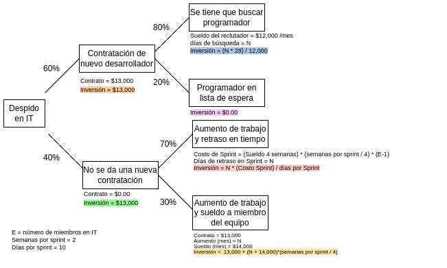

---
title: "Plan de Gestión de Riesgos"
author: [Control y Ejecución Operacional de Proyectos]
date: "2022"
keywords: [Markdown, Example]
...

# Plan de Gestión de Riesgos

## Contenido

1. Identificación de riesgos
   
   1. Riesgos Cualitativos
   
   2. Riesgos Cuantitativos

   3. Matriz de Probabilidad e Impacto

   4. Respuesta al Riesgo
   
2. Protocolo de Respuesta al Riesgo
   
   1. Metodología de análisis de riesgos (según su tipo)
   
   2. Roles, responsabilidades y costos
   
   3. Clasificación de riesgos (RBS)
   
3. Control de Riesgos
   
   1. Implementación de respuesta al riesgo
   
   2. Monitoreo a riesgos identificados
   
   3. Evaluación de efectividad de respuesta al riesgo

## Introducción

El siguiente documento constituye el Plan de Gestión de Riesgos para el proyecto, mismo que describe cómo se estructuran y se llevan a cabo actividades de gestión de riesgos, así como la identificación de los riesgos más probables dada la actual situación del mundo, país y tecnología. Este plan contiene, en primera instancia, una lista detallada de los riesgos identificados y sugerencias de respuesta, para continuar con la descripción de la forma en que se abordan estos riesgos y las herramientas para llevar a cabo su correspondiente mitigación, además de las fuentes de información que se utilizarán para gestionar dichas acciones de respuesta. Adicionalmente, establece los roles y responsabilidades durante los distintos tipos de actividades requeridas y delimita cómo calcular el costo de un riesgo, a fin de marcar una guía para la implementación de las acciones de respuesta y sus implicaciones de recursos en la línea base del proyecto.

## 1. Identificación de Riesgos

En este apartado se presentará un Registro de Riesgos para riesgos cualitativos y otro para riesgos cuantitativos. En cada uno de estos Registros de Riesgos, se presenta cada riesgo con un identificador único,  una descripción con el nivel de detalle necesario para evitar ambigüedad, los dueños potenciales del riesgo (Risk Owners) y principales causas del riesgo.

### 1.1 Riesgos Cualitativos

La tabla siguiente presenta el Registro de Riesgos para todos aquellos riesgos de carácter cualitativo en cuanto a su impacto y tipo de análisis requerido para su implementación.

| ID | Riesgo | Descripción | Risk Owners | Causas |
| --- | --- | --- | --- | --- |
| 1 | Actualización de buscador (browser) en máquinas de desarrollo o pruebas | El browser es el principal cliente de una aplicación web, por lo que una actualización mayor del buscador en máquinas de desarrolladores y/o de pruebas de usuario podría significar funciones deprecadas, sin soporte o inválidas que en otras versiones del browser son válidas. Esto provocaría fallos e inconsistencias del sistema dependiendo de la versión de buscador que se use. | Departamento de IT | Falta de monitoreo en documentación y anuncios de Google Chrome y Firefox, Falta de registro de versión en lista de CIs. |
| 2 | Complicaciones para implementar funcionalidades clave | Durante el desarrollo de un sistema, siempre existe la incertidumbre de que algún feature sea demasiado complejo de implementar, por lo que se complica dicho feature o tarda más en lograrse. | Departamento de IT | Dificultad del proceso, estimaciones equivocadas de tiempo, requerimientos fuera del alcance computacional del proyecto, falta de experiencia por parte del equipo de desarrollo. |
| 3 | Exceso de cambios en el producto | El cliente, durante Sprint Review o en Pruebas de Usuario, presenta demasiadas solicitudes de cambio o nuevas implementaciones al producto iterado. | Project Manager, Departamento de IT | Descontento por parte del cliente con lo que se desarrolló, poca comunicación del Project Manager con el cliente sobre lo que se está implementando o cambiando, el cliente no está bien informado sobre el alcance del proyecto. |
| 4 | Pérdida de archivos de diseño (.psd, .ai, etc) | El software que el equipo de Diseño utiliza es propenso a "congelarse" y provocar la interrupción del sistema operativo de la máquina donde se trabaja, lo que resulta comúnmente en el repentino reinicio de la computadora sin guardado de cambios en los archivos. | Departamento de Diseño | Exceso de procesos en la RAM, poco monitoreo del estado de la RAM, saturación de llamadas al CPU (clicks), falta de versiones guardadas como respaldo. | 
| 5 | Interrupción del presupuesto por parte de inversionistas | En cualquier momento durante el desarrollo del sistema se puede presentar un corte repentino del presupuesto planeado, ya sea por causas internas o externas al equipo del proyecto. | Project Manager, Departamento de Logística | Descontento de inversionistas, falta de comunicación, problemas económicos por parte de inversionistas (recortes, inflación, despidos). |
| 6 | Una aplicación similar sale al mercado antes que la nuestra. | Existe el riesgo latente en la industria tecnológica de que una aplicación similar exista en el mercado antes de que el proyecto sea liberado al mercado, lo que puede representar un cambio radical en los ingresos planeados, precio de venta y respuesta del mercado. | Departamento de Calidad | Naturaleza de cambio rápido y constante en la industria tecnológica, violaciones al acuerdo de privacidad por parte de algún miembro del equipo, falta de planeación de la respuesta ante tal contingencia. |
| 7 | Nuevas leyes de privacidad en el uso de los datos clínicos. | Existe la posibilidad que durante el transcurso del proyecto, nuevas leyes sean aprobadas acerca del uso y manejo de datos clínicos de pacientes y/o doctores, por lo que funcionalidades de la aplicación podrían pasar de legales a ilegales. | Departamento de Logística | Aprobación de nuevas leyes en el ámbito por parte Estatal o Federal, poco monitoreo de iniciativas en Cámara de Diputados. |
| 8 | Pérdida de datos durante testing o desarrollo. | Durante el proceso de desarrollo del sistema y base de datos, este riesgo se refiere al caso donde por algún error o caso de prueba no previsto, se realice alguna modificación irremediable en la base de datos que resulte en la pérdida de datos o modelos importantes en la base de datos. | Departamento de IT, Departamento de Calidad | Falta de respaldos en la base de datos, ignorar la regla de utilización de **versión local** de la base de datos, Unit Tests de los *controllers* no previstos. |
| 9 | Demandas por parte del equipo de trabajo. | Algún miembro o ex-miembro del equipo presenta una demanda legal al equipo del proyecto. | Departamento de Logística | Despidos injustificados, descontentos o maltratos no controlados, falta de atención legal en los procesos de renuncia y despidos. |
| 10 | Sistema resultante (iterado o final) es demasiado lento (execution time). | El sistema entregado al final de un Sprint o del proyecto, al unirse con las demás iteraciones, presenta un tiempo de respuesta demasiado lento en las máquinas de pruebas. | Departamento de Calidad | Fallos en análisis de métricas de mantenimiento de software, complejidad computacional del prototipo es de $O(n^3)$ o mayor, modularidad del código no supervisada por las métricas actuales. |

### 1.2 Riesgos Cuantitativos

Similar a la sección anterior, la tabla siguiente presenta el Registro de Riesgos para todos aquellos riesgos de carácter cuantitativo en cuanto a su impacto y tipo de análisis requerido para su implementación. 

| ID | Riesgo | Descripción | Risk Owners | Causas |
| --- | --- | --- | --- | --- |
| 11 | Almacenamiento en la nube excedido repentinamente. | Este riesgo se refiere al caso donde la capacidad de almacenamiento contratado hasta el momento no sea suficiente para continuar con el cronograma o sea rebasado antes de lo previsto, resultando en cobros por exceso de almacenamiento. | Departamento de IT | Falta de monitoreo en los *logs* del clúster de datos y/o mensajes por parte de la empresa de almacenamiento, ejecuciones en la base de datos que por error saturan el almacenamiento. |
| 12 | Renuncias por parte del equipo del proyecto | Durante el trancurso del proyecto, siempre existe la posibilidad de que un miembro del equipo ya no forme parte del mismo, sin algún aviso o con poco tiempo de anticipación, provocando reorganización o retrasos en el cronograma. | Project Manager, Departamento de Logística | Algún miembro del equipo presenta problemas personales y renuncia por lo mismo, o renuncias por situaciones que se sucitan en el proyecto, descontentos o quejas no resueltas. |
| 13 |  Despidos por parte del equipo del proyecto | Durante el trancurso del proyecto, siempre existe la posibilidad de que un miembro del equipo sea despedido. | Project Manager, Departamento de Logística | Falta de compromiso por parte del agraviado, rendimiento deficiente, falta de motivación, comportamientos que no reflejan la filosofía del equipo. |
| 14 | Falta de personal | Existe la posibilidad de que, durante el desarrollo del proyecto, los recursos humanos sean insuficientes para cumplir con el cronograma, lo que resultaría en retrasos y/o nuevas contrataciones | Project Manager, Departamento de Logística | Estimaciones de carga de trabajo y tiempo poco realistas, exceso de *bugs* o implementaciones no previstas, procesos complejos no previstos en el cronograma. |
| 15 | Falta de presupuesto | Puede ocurrir que, durante la realización de las actividades del proyecto, se requiera de inversiones nuevas no previstas. | Project Manager, Departamento de Logística | Actividades no previstas en el cronograma, gastos repentinos no contemplados, complejidad de actividades rebasa las estimaciones. |

### 1.3 Matriz de Probabilidad e Impacto

El protocolo de mitigación de riesgo se aplicará cuando, en el Sprint Planning, una Tarea lleve consigo alguno de los riesgos de las tablas anteriores y además **dicho riesgo se encuentre en áreas de prioridad**. Con el fin de establecer una guía general sobre las áreas de prioridad y qué riesgos previstos se encuentran ahí, se presenta la siguiente Matriz de Probabilidad e Impacto. En esta matriz, los riesgos que se encuentren en el área sin sobreado se clasifican como **de mínima acción**, y un protocolo de mitigación no sería necesario. En lugar del protocolo de mitigación, sólo será necesario **informar a los involucrados para su monitoreo**, pues son riesgos que con correcta atención se evitarían. A su vez, los riesgos que se encuntran en áreas sombreadas de cualquier tono, se encuentran en **áreas de prioridad**, por lo que la aplicación del protocolo de mitigación/respuesta al riesgos es necesaria.

{width=12cm}

### 1.4 Respuesta al Riesgo

En la siguiente tabla se muestran las repsuestas generales sugeridas desde la etapa de Planeación para los riesgos previstos en las secciones 1.1 y 1.2. En la sección que sigue se establece que, al ser sugerencias generales, tras la etapa de análisis para la mitigación de un riesgo previsto en un Sprint, se especificarán estas sugerencias u otras por completo en Tareas de mitigación detalladas y concretas dentro del Sprint Backlog.

| ID | Riesgo | Respuestas Preventivas | Respuestas Correctivas | Estimación: tiempo y personas* |
| --- | --- | --- | --- | --- |
| 1 | Actualización de buscador (browser) | Monitorear anuncios de Google Chrome y Firefox, documentar la versión actual después de cada día de desarrollo. | Regresar a la última versión documentada donde las funcionalidades no sufrían cambios. | 1 día, Equipo IT. |
| 2 | Complicaciones de implementación | Heredar tareas de menor prioridad a otro Sprint para dedicar el presente Sprint a la implementación de tareas complejas. | Atacar problemas con otras alternativas de programación, proponer soluciones y citar al socio fundador para la elección de la solución alternativa. | 1 Sprint (15 d), Equipo IT + Calidad. |
| 3 | Exceso de cambios del cliente | Limitar cambios de acuerdo al presupuesto y darlo a conocer al cliente/socio. | Organizar los cambios de forma que no afecten entregables ya en curso, a fin de evitar tiempos muertos o procesos cruzados. | 0.5 Sprint, Project Manager + Socio fundador. |
| 4 | Pérdida de archivos de diseño | Crear varios respaldos constantemente. Implementar un sistema de respaldos en la nube (OneDrive, Drive, Dropbox), organizados por mes. | Volver a realizar los cambios perdidos. Descargar la última versión guardada si se tiene respaldo. | 0.5 Sprint, Departamento de Diseño. |
| 5 | Interrupción del presupuesto | Agregar un porcentaje del 15% de las inversiones iniciales a la reserva a causa de este riesgo. Mantener constante contacto con los stakeholders que manejar los recursos monetarios. | Reuniones informativas con los stakeholders. Después, se relizaría una búsqueda de nuevos inversores, incluso fondos de gobierno. Recorte de personal y/o agilización de tiempos en el cronograma. | 2 Sprints, Equipo Logística. |
| 6 | Aplicación similar sale antes | Buscar features diferenciadoras y dejarlos en privado, sin publicar, sólo con conocimiento de los líderes de cada departamento, para evitar filtraciones. |  Retrasar la fecha de lanzamiento de la aplicación, incluir una campaña nuevo de publicidad y analizar los features diferenciadores de la acción preventiva. | 2.5 Sprints, todos los departamentos. |
| 7 | Nuevas leyes de privacidad | Asesoría legal previa a la implementación, a fin de buscar tendencias futuras en materia de privacidad de datos. | Capacitación al equipo acerca de los cambios legales y lo que involucran. Cambiar el *firmware* que maneja todos los asuntos de seguridad informática. | 1-5 Sprints (dependiendo de la severidad), Abogados asociados en el proyecto + Project Manager + Inversionistas. |
| 8 | Pérdida de datos en tests | Generar un ambiente de desarrollo para QA (Quality Assurance) donde se utilice **una copia** de la base datos de producción, mas no la misma. Documentar el link para la conexión a la base datos del ambiente en el que se trabaja. | Crear otra copia de la base de datos de producción para QA, a fin de desechar la base de datos de QA con pérdidas. | 1 día, Equipo IT. |
| 9 | Demandas del equipo | Tomar medidas preventivas en los contratos de los empleados para evitar demandas injustificadas. Tener un protocolo de acción si se anticipa una demanda. | Contactar a los abogados asociados, ver temas en Junta de Conciliación y Arbitraje. | 3 Sprint, Abogados asociados. |
| 10 | Sistema es lento | Al implementar funcionalidades, realizar un análisis y reportar la Complejidad Computacional de lo implementado, utilizando notación *Big O*. Cuestionar la implementación si una complejidad es igual o mayor a $O(n^3)$. | Analizar secciones del código con bucles y buscar rediseñar el uso de memoria RAM o ciclos para reducir aquellas complejidades $O(n^3)$ o superiores. Reimplementar con dichos cambios. | 2-3 días, Equipo Calidad. |
| 11 | Almacenamiento excedido repentinamente | Al iniciar un nuevo día de implementación, checar si los *logs* del clúster de datos adquirido muestra advertencias de espacio, a fin de evitar cobros inesperados por exceder de espacio. | Analizar *controllers* que manipulan la base de datos a fin de encontrar errores que están saturando la base datos. Si los datos son correctos, habrá que contratar más almacenamiento. | 1-2 días, Equipo IT. |
| 12 | Renuncias del equipo | Realizar actividades de Team Building, con el fin de crear un ambiente de confianza y compromiso. Tener varios contactos en lista de espera para ser contratados si se da el caso. | Reacomodar la carga de trabajo del presente Sprint, decidir si se contrata o no a personal nuevo. | 2 Sprints, Project Manager, Departamento de Logística. |
| 13 | Despidos del equipo | Monitoreo del presupuesto para evitar cortes. Capacitación sobre las cláusulas del contrato de los empleados. | Tomar medidas con los Abogados asociados, para evitar compensaciones adicionales. Reacomodar la carga de trabajo del presente Sprint, decidir si se contrata o no a personal nuevo. | 3 Sprints, Abogados asociados + Departamento de Logística. |
| 14 | Falta de personal | Distribuir la carga de trabajo con ayuda del Scrum Master y el líder del equipo involucrado, para evitar cargas excedentes de trabajo. | Valorar si se tiene que contratar a alguien o si dividendo las tareas entre los existentes es suficiente. | 3 Sprints, Abogados asociados + Project Manager. |
| 15 | Falta de presupuesto | Llevar un control estricto de adquisiones y gastos por Sprint. Realizar auditorías preventivas para anticipar posibles gastos fuera del presupuesto. | Realizar una lista de potenciales inversionistas o fondos. | 3 Sprints, Departamento de Logísticas. |

*La estimación del costo para las respuestas al riesgo de esta tabla estarán disponibles hasta la etapa de análisis cualitativo o cuantitativo de cada riesgo cuando se de el Sprint Planning correspondiente, y se conocerá como **Costo Neto del Riesgo**. Dicho costo se calcula siguiendo la fórmula de la Sección 2.2.

## 2. Protocolo de Respuesta al Riesgo

A continuación se presentan las estrategias principales para responder a los riesgos previstos en las dos secciones anteriores y que se encuentren en las áreas de prioridad de la Sección 1.3. Dichas estrategias difieren según el tipo de riesgo (cualitativo o cuantitativo), por lo que se hará la distinción entre las estrategias a seguir en caso de riesgos previstos de tipo cualitativo y de tipo cuantitativo. Sin embargo, ambas estrategias llevan a cabo las siguientes fases generales:

- Análisis: se requiere una etapa de análisis una vez que se determina en el Sprint Planning que una tarea del presente Sprint conlleva algún riesgo de las secciones 1.1 y 1.2. En esta etapa se busca identificar las causas de dicho riesgo.

- Respuesta: una vez conducida la etapa de análisis de causas del riesgo, el equipo está listo para proponer actividades de respuesta al riesgo, ya sean nuevas o tomando en cuenta las sugerencias de la Sección 1.4. En esta etapa se busca que el equipo identifique y documente la respuesta más conveniente.

Debido a la cantidad de riesgos que se preveen en el proyecto según las secciones 1.1 y 1.2, resulta poco conveniente establecer en este Plan las causas explícitas de cada riesgo, así como las respuestas a dichos riesgos con mayor detalle que la Sección 1.4. Adicionalmente, la naturaleza del presente proyecto ágil de software sugiere que un análisis exhaustivo y una propuesta de respuestas por cada riesgo previsto se pueden establecer una vez que el proyecto está en marcha, y no durante este Plan. Por lo tanto, en las siguientes secciones, se presenta el protocolo general (aunque detallado) a seguir en caso de identificar un riesgo previsto o nuevo en el Sprint Planning.
   
### 2.1. Metodología de análisis y respuesta ante riesgos (según su tipo)

**Riesgos Cualitativos: análisis y respuesta**

En cuanto al análisis de cada riesgo cualitativo previsto en la tabla de la Sección 1.1 y que sea relevante según la tabla de la sección 1.3, éste comienza cuando el Sprint Planning implemente la(s) actividad(es) que involucren algún riesgo de dicha tabla. Si durante esta reunión se identifica que se implementará alguna actividad que conlleve algún riesgo previsto y relevante, la etapa de análisis deberá llevarse a cabo. En caso de que se prosiga a analizar algún riesgo cualitativo, se deberá realizar el siguiente proceso:

1. Análisis de causa y efecto
   
La etapa de análisis de un riesgo cualitativo comienza con un diagrama de causa y efecto (de pescado), a fin de identificar máximo **4 causas principales de tal riesgo (efecto)**, donde cada una de estas 4 causas tendrá **1 subcausa principal**. Dicho diagrama se comienza con el riesgo o amenaza, y se exploran las posibles causas que llevarían a que dicho riesgo ocurra. El diagrama seguirá el siguiente formato:

{width=10cm}

2. Una vez que se tenga el diagrama, se tendrá claro cuáles serían las causas de que dicho riesgo se presente. Estas 4 causas presentes en el diagrama serán el input dentro de la siguiente herramienta de análisis: Tabla AMEF, a fin de ordenar por prioridad las 4 causas.

El AMEF es una herramienta de análisis eficaz que ayuda a detectar problemas potenciales y sus **efectos** dentro del proyecto. Dicha herramienta se implementará con la siguiente tabla:

| Causa/problema | Alcance del problema | Severidad (S) | Ocurrencia (O) | Detección (D) | NPR | Responsable |
| --- | --- | --- | --- | --- | --- | --- |
| Causa 1 | Efecto inmediato | 1 <= S <= 10 | 1 <= O <= 10 | 1 <= D <= 10 | $NPR = S \times O \times D$ | Nombre(s) |
| ... | ... | ... | ... | ... | ... | ... |
| Causa 4 | ... | ... | ... | ... | ... | ... |

Donde: 

- S: número de severidad de dicha falla, mismo que permitirá darle seguimiento oportuno a las acciones. Ejemplo: 10, usuario deja de usar la aplicación; 9, usuario escribe reseña negativa.

- O: el nivel de la frecuencia con la que acontecen o la facilidad con la que se pueden detectar. Esto permitirá tomar acciones preventivas comenzando con las que tengan un grado mayor de prioridad. Ejemplo: 10, error de dedo; 9, falta de conocimiento.

- D: número de acuerdo con el grado de detección de cada falla. Mientras más grande sea el número, más fácil de detectar es aquella falla o causa del riesgo, en este caso.

- NPR: Número Prioritario de Riesgo (NPR), es el valor que establece la prioridad de dicha causa del riesgo.
  
Una vez que se tenga esta nformación de las 4 causas (filas en la tabla), de acuerdo al NPR, las filas del AMEF se ordenan: hasta arriba será la fila de la causa más importante del riesgo.

3. Cuando se tengan las causas ordenadas de acuerdo al NPR en la Tabla AMEF, seguirá la toma de decisiones: por medio de una reunión o no, se decidirán **nuevas Tareas de mitigación para el Sprint Backlog** que involucren las acciones de mitigación a tomar **para la causa principal (primera fila del AMEF), y serán incluidas y priorizadas** dentro de dicho Sprint Backlog. A su vez deberá incluir, cada una de estas nuevas Tareas, el **tiempo y personal requerido**. Estas tareas, como se especificó, pueden o no implementar las respuestas de la Sección 1.4, dependiendo de lo que arroje el análisis como mejor opción.

4. El NPV (Net Path Value), descrito en la sección siguiente con mayor detalle, se deberá calcular una vez que se establecieron las Tareas de mitigación del punto anterior. El NPV en el caso de riesgos cualitativos es la suma de las inversiones necesarias por cada tarea nueva. La inversión de cada tarea se calcula de la siguiente manera:

$$
inv_i = \left[ \left( \hbox{días} \times \frac{\hbox{sueldo mensual}}{20^*} \right) \times \hbox{personas} \right] + \hbox{adquisiciones}
$$

para así calcular el NPV:

$$
NPV = \sum^{N}{inv_{i}}
$$

donde $N$ representa la cantidad de Tareas nuevas a implementar como respuesta o mitigación al riesgo. *20 divide al salario mensual para calcular el salario por día, ya que 5 días hábiles por 4 semanas resulta en 20.

De esta manera, en NPV determinará los recursos monetarios que representa la mitigación del riesgo en cuestión, dados el tiempo y personas especificadas al incluir cada Tarea en el Sprint Backlog.

**Riesgos Cuantitativos: análisis y respuesta**

1. La etapa de análisis de un riesgo cualitativo de prioridad comienza con la identificación de las posibles decisiones a tomar ante el riesgo. Estas posibles decisiones se acomodan en un Diagrama de Árbol. A continuación se presenta el diagrama de árbol para las posibles decisiones ante un despido en el área de IT:

{width=8cm}

2. Se continúa trabajando sobre el mismo diagrama de árbol, donde ahora el siguiente paso es establecer las probabilidades de que las decisiones plasmadas ocurran, además de los costos por nodo invidual (Inversión). Los costos por nodo (Inversión) sólo establecen el costo neto de que se realice o suceda dicha decisión.

{width=14cm}

3. Se calcula el NPV (Net Path Value), que es costo de cada rama hasta su final, donde el costo es la suma de las multiplicaciones de Inversión por probabilidad. Así, se obtiene **la cantidad de dinero involucrado por rama de posibilidad del riesgo**, con el fin de facilitar la decisión al mostrar lo que compromete cada camino de decisión.

{width=14cm}

4. Se decide cuál ramificación de decisiones se llevará a cabo por medio de una reunión. Estas decisiones, como se especificó anteriormente, pueden o no implementar las respuestas de la Sección 1.4, dependiendo de lo que arroje el análisis como mejor opción.

5. Una vez que se decide cuál ramificación de actividades realizar, cada nodo se convertirá en una Tarea para el Sprint Backlog del sprint que se busca iniciar. **Las probabilidades serán del 100%** para los nodos de la rama elegida, y **0% para cualquier otro nodo**. De esta manera, **el NPV de la rama elegida será la suma de las inversiones de cada nodo**:

$$
NPV = \sum^{N}{inv_{i}}
$$

De esta forma, el protocolo a seguir ante cualquier riesgo que sea parte de las Tareas en un Sprint y se prevee en el Sprint Planning, generará nuevas Tareas de respuesta/preventivas al riesgo de la siguiente manera:

{width=10cm}
   
### 2.2. Roles, responsabilidades y costos

El equipo de cada departamento del proyecto asumirá ciertas responsabilidades, las cuales se plantean a continuación. A su vez, esta dedicación de tiempo por parte del equipo de trabajo representa un costo adicional al planteado por las actividades del protocolo mitigación de riesgos de la sección anterior, mismo que también se tratará al final de esta sección.

Las responsabilidades ante la presencia de algún riesgo en las Tareas de un Sprint son:

- El **Project Manager** debe conducir la reunión del Sprint Planning, donde se debe identificar si el Sprint siguiente contiene alguna actividad de riesgo previsto y de prioridad. De ser así, se prosigue con los siguientes puntos.

- En las tablas de las secciones 1.1 y 1.2 se provee de un **Risk Owner**, que es el departamento directamente involucrado en el riesgo previsto. Dicho departamento tiene la responsabilidad de **convocar una reunión** para realizar los formatos de **análisis del riesgo**: el diagrama de pescado (en riesgos cualitativos) y el diagrama de árbol (en riesgos cuantitativos).

- De tratarse de riesgo cuantitativo, el departamento **Risk Owner** también es responsable de invitar a dicha reunión al líder de finanzas.

- Una vez completado el análisis, el **líder del departamento** es responsable de **decidir si convocar una reunión** para la creación de tickets de Tareas para el Sprint Backlog junto con el **Scrum Team y el Scrum Master**, o si sólo el **Scrum Master** es capaz de **establecer y estimar los tickets de Tareas de mitigación**. Estos tickets deberán contener la estimación de tiempo en días y la cantidad de personal involucrado.
  
- El **Project Manager** es responsable de **introducir y priorizar** en el Sprint Backlog dichas Tareas de mitigación de riesgo generadas y estimadas, además de pasar **la información de inversión requerida** para dichas Tareas al **departamento de finanzas**.

- Una vez en el Sprint Backlog, **las Tareas de mitigación de riesgo se dividen entre el Scrum Team y se implementan** en el Sprint.

Los costos involucrados en la planeación y análisis **que dura 3 días como máximo** de riesgos son calculados de la siguiente manera:

$$
\hbox{Costo de planeación} = P \times Sueldo \times \frac{3}{\hbox{días hábiles por mes}}
$$

donde:

$$
\hbox{días hábiles por mes} = 20,
$$

$$
P = \hbox{personas involucradas},
$$

$$
Sueldo = \hbox{sueldo mensual}
$$

para así sumar dichos costos al NPV:

$$
\hbox{Costo Neto del Riesgo} = NPV_{decisión} + \hbox{Costo de planeación}
$$

Nota: importante tratar de llevar a cabo el análisis y generación de Tareas de mitigación de riesgo en 3 días hábiles, a fin de no retrasar el Sprint.
   
### 2.3. Clasificación de riesgos

Los riesgos previstos en las tablas de la Sección 1.1 y 1.2 se clasificaron inicialmente por el tipo de análisis (cualitativo y cuantitativo) necesario para establecer una respuesta. Ahora, con el fin de identificar los riesgos por sus fuentes, se clasifican utilizando una RBS (Risk Breakdown Structure), misma que es una estructura jerárquica de las posibles causas de los riesgos del proyecto.

{width=12cm}

## 3. Control de Riesgos
   
### 3.1. Implementación de respuesta al riesgo

La implementación de respuesta al riesgo es el proceso de implementar la alternativa acordaba al final de las reuniones después del análisis del riesgo: se trata de la implementación de las Tareas agregadas al Sprint Backlog por parte del riesgo analizado. El beneficio de este proceso es el llevar a cabo acciones que minimizen las amenazas y maximizen las oportunidades que el riesgo previsto representa. 

El Scrum Team junto con el Scrum Master, como se estipula en la Sección 2.2, deberán decidir los miembros del equipo que desarrollarán las Tareas de mitigación. Su implementación se dará como cualquier otra Tarea en el Sprint Backlog, pero además requiere de otras actividades. La implementación de estas nuevas Tareas de mitigación conlleva lo siguiente:

- Antes de comenzar su implementación se debe asegurar que el cronograma, recursos y Costo Neto del Riesgo está contemplado en la línea base del proyecto. Para ello, durante el Daily Scrum se debe informar que se está a punto de implementar una Tarea de mitigación, y el Project Manager se asegura que esto forma parte del plan.

- Se debe llevar a cabo un Reporte de Riesgo, mismo que servirá para la evaluación del desempeño de la respuesta al riesgo. El Reporte de Riesgo es un documento con los resultados obtenidos después de la implementación, monitoreo y control de las Tareas de mitigación de un riesgo previsto. Estos resultados del reporte deben incluir: 
  
  - Fecha, tiempo, recursos y efecto en el proyecto o Sprint. 
  
  - Si se realizan **Solicitudes de Cambio** como consecuencia a la implementación de una Tarea de mitigación, se deberán incluir como listado en el Reporte de Riesgo, con el ID de la Solicitud de Cambio o SCCI (si se trata de cambios en los CIs).
 
### 3.2. Monitoreo a riesgos identificados

Este proceso se encarga del monitoreo durante la implementación de las Tareas de mitigación acordadas, seguir de cerca las consecuencias y analizar posibles nuevos riesgos.

El monitoreo se basa en la información registrada en el Reporte de Riesgo durante la implementación y la línea base del proyecto en cuanto a tiempo, recursos y costos.

Para el monitoreo de la información del Reporte de Riesgo se recomienda:

- Realizar un diagrama de control con el historial de las Solicitudes de Cambio o SCCIs a lo largo del proyecto, donde se analizan el número de las Solicitudes de Cambio o SCCIs que se reportan como consecuencia del cambio implementado. Dicho diagrama de control tendrá **un límite de alerta**, ubicado a $2 \times \sigma$ del promedio de número de Solicitudes de Cambio $\overline{X}$ por semana. A continuación se presenta un ejemplo de gŕafico de control para analizar anomalías en la cantidad de cambios por consecuencia de Tareas de mitigación que fueron implementadas en las semanas marcadas en rojo. La línea de alerta, que se encuentra a $2\sigma$ del promedio de cambios, indica que las Tareas de mitigación implicaron una cantidad de cambios que deben ser supervisados de cerca. 

   {width=8cm}

- Una vez graficado el diagrama de control, de presentarse cantidades de Solicitudes de Cambios anormales (arriba del límite de alerta), se contactará al Departamento de Calidad para que se analice si dichas cantidades de cambios para la mitigación son normales o se está presentando **un nuevo riesgo** no previsto consecuente al riesgo mitigado, ya que cantidades anormales de cambios podrían ser consecuencia de un problema latente que se tiene y se está buscando controlar con cambios, pero que sólo esta desencadenando más y más ajustes, lo que debe tratarse de una amenaza nueva.
 
### 3.3. Evaluación de efectividad de respuesta al riesgo

La evaluación de la efectvidad de la respuesta al riesgo, implementada y monitoreada de acuerdo a las secciones anteriores, se llevará a cabo mediante una auditoría al finalizar el Sprint. 

- El Project Manager es el responsable de asegurarse de que las auditorías de riesgos se realicen con la misma frecuencia que los Sprint Review, e incluso puede incluir la auditoría dentro del mismo Review.

- La auditoría será facilitada por el Director de Calidad, con los siguientes objetivos:

  -  Comparar el **Valor Ganado de dicho Sprint con el Valor Ganado Planeado**, 
  
  -  Comparar el **Costo Real de dicho Sprint con el Costo Real Planeado**,

   - Establecer si las implicaciones de recursos y tiempo para la mitigación del riesgo es menor que **la Severidad (S)** (en tabla AMEF realizada para dicho riesgo) del riesgo en el proyecto: si es menor la mitigación que la severidad, quiere decir que las acciones han valido la pena. Registrar dicha conclusión en el Reporte de Riesgo y en el riesgo correspondiente dentro del Registro de Riesgos de las secciones 1.1 y 1.2.