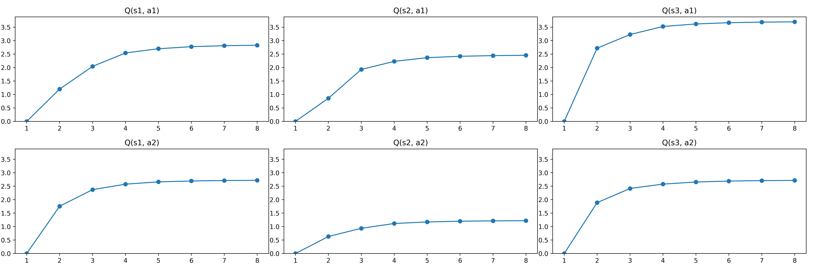
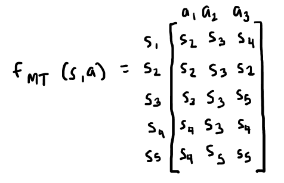
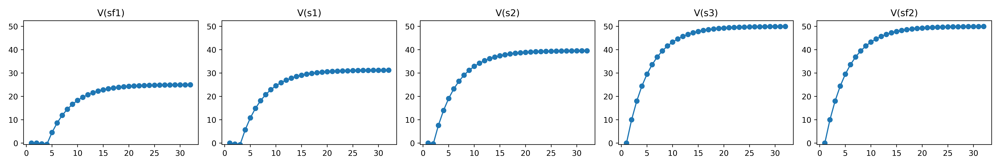
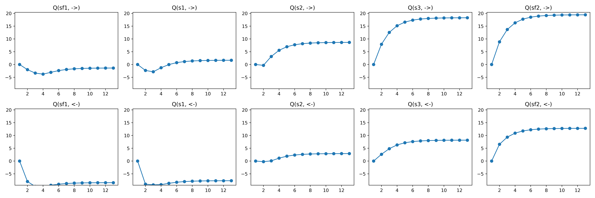

---
title: "Reinforcement Learning: Homework 3"
author: [Mariana Avalos Arce]
date: "2022"
keywords: [Markdown, Example]
geometry: margin=1in
fontsize: 12pt
fontenc: T1
fontfamily: sourcesanspro  
fontfamilyoptions: sfdefault
...

# Homework 03: Value Iteration

1. Given the world defined by the following Transition Function `fmt(s, a)`, the Reward Function `fr(s, a, sf)` and `gamma = 0.9`:

    

    a. Solve the Bellman Optimality Equations by Value Iteration for V(s).

    ## Solution

    - It was solved in 45 iterations, if we assume that **a change of less than 0.1 between iterations** means it converged:

    ```
    ==========================
    Iteration 1:
    fr: [2, 1, -1, 10]
    s1      s2      s3      s4
    V(s) current
    0.00    0.00    0.00    0.00
    V(s) new
    1.00    2.90    2.90    10.00
    ==========================
    Iteration 2:
    fr: [2, 1, -1, 10]
    s1      s2      s3      s4
    V(s) current
    1.00    2.90    2.90    10.00
    V(s) new
    3.61    5.25    5.25    19.00
    ==========================
    Iteration 3:
    fr: [2, 1, -1, 10]
    s1      s2      s3      s4
    V(s) current
    3.61    5.25    5.25    19.00
    V(s) new
    5.72    7.15    7.15    27.10
    ==========================
    Iteration 4:
    fr: [2, 1, -1, 10]
    s1      s2      s3      s4
    V(s) current
    5.72    7.15    7.15    27.10
    V(s) new
    7.44    8.69    8.69    34.39
    ==========================
    Iteration 5:
    fr: [2, 1, -1, 10]
    s1      s2      s3      s4
    V(s) current
    7.44    8.69    8.69    34.39
    V(s) new
    8.82    9.94    9.94    40.95
    ==========================
    Iteration 6:
    fr: [2, 1, -1, 10]
    s1      s2      s3      s4
    V(s) current
    8.82    9.94    9.94    40.95
    V(s) new
    9.95    10.95   10.95   46.86
    ==========================
    Iteration 7:
    fr: [2, 1, -1, 10]
    s1      s2      s3      s4
    V(s) current
    9.95    10.95   10.95   46.86
    V(s) new
    10.86   11.77   11.77   52.17
    ==========================
    Iteration 8:
    fr: [2, 1, -1, 10]
    s1      s2      s3      s4
    V(s) current
    10.86   11.77   11.77   52.17
    V(s) new
    11.59   12.43   12.43   56.95
    ==========================
    Iteration 9:
    fr: [2, 1, -1, 10]
    s1      s2      s3      s4
    V(s) current
    11.59   12.43   12.43   56.95
    V(s) new
    12.19   12.97   12.97   61.26
    ==========================
    Iteration 10:
    fr: [2, 1, -1, 10]
    s1      s2      s3      s4
    V(s) current
    12.19   12.97   12.97   61.26
    V(s) new
    12.68   13.41   13.41   65.13
    ==========================
    Iteration 11:
    fr: [2, 1, -1, 10]
    s1      s2      s3      s4
    V(s) current
    12.68   13.41   13.41   65.13
    V(s) new
    13.07   13.76   13.76   68.62
    ==========================
    Iteration 12:
    fr: [2, 1, -1, 10]
    s1      s2      s3      s4
    V(s) current
    13.07   13.76   13.76   68.62
    V(s) new
    13.38   14.05   14.05   71.76
    ==========================
    Iteration 13:
    fr: [2, 1, -1, 10]
    s1      s2      s3      s4
    V(s) current
    13.38   14.05   14.05   71.76
    V(s) new
    13.64   14.28   14.28   74.58
    ==========================
    Iteration 14:
    fr: [2, 1, -1, 10]
    s1      s2      s3      s4
    V(s) current
    13.64   14.28   14.28   74.58
    V(s) new
    13.85   14.46   14.46   77.12
    ==========================
    Iteration 15:
    fr: [2, 1, -1, 10]
    s1      s2      s3      s4
    V(s) current
    13.85   14.46   14.46   77.12
    V(s) new
    14.02   14.62   14.62   79.41
    ==========================
    Iteration 16:
    fr: [2, 1, -1, 10]
    s1      s2      s3      s4
    V(s) current
    14.02   14.62   14.62   79.41
    V(s) new
    14.15   14.74   14.74   81.47
    ==========================
    Iteration 17:
    fr: [2, 1, -1, 10]
    s1      s2      s3      s4
    V(s) current
    14.15   14.74   14.74   81.47
    V(s) new
    14.27   14.84   14.84   83.32
    ==========================
    Iteration 18:
    fr: [2, 1, -1, 10]
    s1      s2      s3      s4
    V(s) current
    14.27   14.84   14.84   83.32
    V(s) new
    14.35   14.92   14.92   84.99
    ==========================
    Iteration 19:
    fr: [2, 1, -1, 10]
    s1      s2      s3      s4
    V(s) current
    14.35   14.92   14.92   84.99
    V(s) new
    14.43   14.98   14.98   86.49
    ==========================
    Iteration 20:
    fr: [2, 1, -1, 10]
    s1      s2      s3      s4
    V(s) current
    14.43   14.98   14.98   86.49
    V(s) new
    14.49   15.04   15.04   87.84
    ==========================
    Iteration 21:
    fr: [2, 1, -1, 10]
    s1      s2      s3      s4
    V(s) current
    14.49   15.04   15.04   87.84
    V(s) new
    14.53   15.08   15.08   89.06
    ==========================
    Iteration 22:
    fr: [2, 1, -1, 10]
    s1      s2      s3      s4
    V(s) current
    14.53   15.08   15.08   89.06
    V(s) new
    14.57   15.12   15.12   90.15
    ==========================
    Iteration 23:
    fr: [2, 1, -1, 10]
    s1      s2      s3      s4
    V(s) current
    14.57   15.12   15.12   90.15
    V(s) new
    14.60   15.14   15.14   91.14
    ==========================
    Iteration 24:
    fr: [2, 1, -1, 10]
    s1      s2      s3      s4
    V(s) current
    14.60   15.14   15.14   91.14
    V(s) new
    14.63   15.17   15.17   92.02
    ==========================
    Iteration 25:
    fr: [2, 1, -1, 10]
    s1      s2      s3      s4
    V(s) current
    14.63   15.17   15.17   92.02
    V(s) new
    14.65   15.18   15.18   92.82
    ==========================
    Iteration 26:
    fr: [2, 1, -1, 10]
    s1      s2      s3      s4
    V(s) current
    14.65   15.18   15.18   92.82
    V(s) new
    14.67   15.20   15.20   93.54
    ==========================
    Iteration 27:
    fr: [2, 1, -1, 10]
    s1      s2      s3      s4
    V(s) current
    14.67   15.20   15.20   93.54
    V(s) new
    14.68   15.21   15.21   94.19
    ==========================
    Iteration 28:
    fr: [2, 1, -1, 10]
    s1      s2      s3      s4
    V(s) current
    14.68   15.21   15.21   94.19
    V(s) new
    14.69   15.22   15.22   94.77
    ==========================
    Iteration 29:
    fr: [2, 1, -1, 10]
    s1      s2      s3      s4
    V(s) current
    14.69   15.22   15.22   94.77
    V(s) new
    14.70   15.23   15.23   95.29
    ==========================
    Iteration 30:
    fr: [2, 1, -1, 10]
    s1      s2      s3      s4
    V(s) current
    14.70   15.23   15.23   95.29
    V(s) new
    14.71   15.24   15.24   95.76
    ==========================
    Iteration 31:
    fr: [2, 1, -1, 10]
    s1      s2      s3      s4
    V(s) current
    14.71   15.24   15.24   95.76
    V(s) new
    14.71   15.24   15.24   96.18
    ==========================
    Iteration 32:
    fr: [2, 1, -1, 10]
    s1      s2      s3      s4
    V(s) current
    14.71   15.24   15.24   96.18
    V(s) new
    14.72   15.25   15.25   96.57
    ==========================
    Iteration 33:
    fr: [2, 1, -1, 10]
    s1      s2      s3      s4
    V(s) current
    14.72   15.25   15.25   96.57
    V(s) new
    14.72   15.25   15.25   96.91
    ==========================
    Iteration 34:
    fr: [2, 1, -1, 10]
    s1      s2      s3      s4
    V(s) current
    14.72   15.25   15.25   96.91
    V(s) new
    14.72   15.25   15.25   97.22
    ==========================
    Iteration 35:
    fr: [2, 1, -1, 10]
    s1      s2      s3      s4
    V(s) current
    14.72   15.25   15.25   97.22
    V(s) new
    14.73   15.25   15.25   97.50
    ==========================
    Iteration 36:
    fr: [2, 1, -1, 10]
    s1      s2      s3      s4
    V(s) current
    14.73   15.25   15.25   97.50
    V(s) new
    14.73   15.26   15.26   97.75
    ==========================
    Iteration 37:
    fr: [2, 1, -1, 10]
    s1      s2      s3      s4
    V(s) current
    14.73   15.26   15.26   97.75
    V(s) new
    14.73   15.26   15.26   97.97
    ==========================
    Iteration 38:
    fr: [2, 1, -1, 10]
    s1      s2      s3      s4
    V(s) current
    14.73   15.26   15.26   97.97
    V(s) new
    14.73   15.26   15.26   98.18
    ==========================
    Iteration 39:
    fr: [2, 1, -1, 10]
    s1      s2      s3      s4
    V(s) current
    14.73   15.26   15.26   98.18
    V(s) new
    14.73   15.26   15.26   98.36
    ==========================
    Iteration 40:
    fr: [2, 1, -1, 10]
    s1      s2      s3      s4
    V(s) current
    14.73   15.26   15.26   98.36
    V(s) new
    14.73   15.26   15.26   98.52
    ==========================
    Iteration 41:
    fr: [2, 1, -1, 10]
    s1      s2      s3      s4
    V(s) current
    14.73   15.26   15.26   98.52
    V(s) new
    14.73   15.26   15.26   98.67
    ==========================
    Iteration 42:
    fr: [2, 1, -1, 10]
    s1      s2      s3      s4
    V(s) current
    14.73   15.26   15.26   98.67
    V(s) new
    14.73   15.26   15.26   98.80
    ==========================
    Iteration 43:
    fr: [2, 1, -1, 10]
    s1      s2      s3      s4
    V(s) current
    14.73   15.26   15.26   98.80
    V(s) new
    14.73   15.26   15.26   98.92
    ==========================
    Iteration 44:
    fr: [2, 1, -1, 10]
    s1      s2      s3      s4
    V(s) current
    14.73   15.26   15.26   98.92
    V(s) new
    14.74   15.26   15.26   99.03
    ==========================
    Iteration 45:
    fr: [2, 1, -1, 10]
    s1      s2      s3      s4
    V(s) current
    14.74   15.26   15.26   99.03
    V(s) new
    14.74   15.26   15.26   99.13
    Optimal Politic:
    s1 = a1,        s2 = a1,        s3 = a2,        s4 = a2,
    ```

    Which gives out a result of:

    |  | s1 | s2 | s3 | s4 |
    | ---- | ---- | ---- | ---- | ---- |
    | V(s) | 14.74  | 15.26  | 15.26 |  99.13 |
    | f_pi(s) | a1 | a1 | a2 | a2 |

    Below is a convergence plot for all V(s) values for each of the states s = {s1, s2, s3, s4}, where x axis is the **amount of iterations** and y axis is the **V(s) result for that iteration**:

     

    b. Solve the Bellman Optimality Equations by Value Iteration for Q(s, a).

    - It was solved in 45 iterations as well, if we assume that **a change of less than 0.1 between iterations** means convergence:

    ```
        ==========================
    Iteration 1:
    fr: [2, 1, -1, 10]
    s1      s2      s3      s4
    Q(s,a) current
    0.00    0.00    0.00    0.00
    0.00    0.00    0.00    0.00
    Q(s,a) new
    1.00    2.90    -1.00   2.90
    3.61    -1.00   5.25    12.61
    ==========================
    Iteration 2:
    fr: [2, 1, -1, 10]
    s1      s2      s3      s4
    Q(s,a) current
    1.00    2.90    -1.00   2.90
    3.61    -1.00   5.25    12.61
    Q(s,a) new
    3.61    5.25    3.72    5.25
    5.72    3.72    7.15    21.35
    ==========================
    Iteration 3:
    fr: [2, 1, -1, 10]
    s1      s2      s3      s4
    Q(s,a) current
    3.61    5.25    3.72    5.25
    5.72    3.72    7.15    21.35
    Q(s,a) new
    5.72    7.15    5.44    7.15
    7.44    5.44    8.69    29.21
    ==========================
    Iteration 4:
    fr: [2, 1, -1, 10]
    s1      s2      s3      s4
    Q(s,a) current
    5.72    7.15    5.44    7.15
    7.44    5.44    8.69    29.21
    Q(s,a) new
    7.44    8.69    6.82    8.69
    8.82    6.82    9.94    36.29
    ==========================
    Iteration 5:
    fr: [2, 1, -1, 10]
    s1      s2      s3      s4
    Q(s,a) current
    7.44    8.69    6.82    8.69
    8.82    6.82    9.94    36.29
    Q(s,a) new
    8.82    9.94    7.95    9.94
    9.95    7.95    10.95   42.66
    ==========================
    Iteration 6:
    fr: [2, 1, -1, 10]
    s1      s2      s3      s4
    Q(s,a) current
    8.82    9.94    7.95    9.94
    9.95    7.95    10.95   42.66
    Q(s,a) new
    9.95    10.95   8.86    10.95
    10.86   8.86    11.77   48.40
    ==========================
    Iteration 7:
    fr: [2, 1, -1, 10]
    s1      s2      s3      s4
    Q(s,a) current
    9.95    10.95   8.86    10.95
    10.86   8.86    11.77   48.40
    Q(s,a) new
    10.86   11.77   9.59    11.77
    11.59   9.59    12.43   53.56
    ==========================
    Iteration 8:
    fr: [2, 1, -1, 10]
    s1      s2      s3      s4
    Q(s,a) current
    10.86   11.77   9.59    11.77
    11.59   9.59    12.43   53.56
    Q(s,a) new
    11.59   12.43   10.19   12.43
    12.19   10.19   12.97   58.20
    ==========================
    Iteration 9:
    fr: [2, 1, -1, 10]
    s1      s2      s3      s4
    Q(s,a) current
    11.59   12.43   10.19   12.43
    12.19   10.19   12.97   58.20
    Q(s,a) new
    12.19   12.97   10.68   12.97
    12.68   10.68   13.41   62.38
    ==========================
    Iteration 10:
    fr: [2, 1, -1, 10]
    s1      s2      s3      s4
    Q(s,a) current
    12.19   12.97   10.68   12.97
    12.68   10.68   13.41   62.38
    Q(s,a) new
    12.68   13.41   11.07   13.41
    13.07   11.07   13.76   66.14
    ==========================
    Iteration 11:
    fr: [2, 1, -1, 10]
    s1      s2      s3      s4
    Q(s,a) current
    12.68   13.41   11.07   13.41
    13.07   11.07   13.76   66.14
    Q(s,a) new
    13.07   13.76   11.38   13.76
    13.38   11.38   14.05   69.53
    ==========================
    Iteration 12:
    fr: [2, 1, -1, 10]
    s1      s2      s3      s4
    Q(s,a) current
    13.07   13.76   11.38   13.76
    13.38   11.38   14.05   69.53
    Q(s,a) new
    13.38   14.05   11.64   14.05
    13.64   11.64   14.28   72.58
    ==========================
    Iteration 13:
    fr: [2, 1, -1, 10]
    s1      s2      s3      s4
    Q(s,a) current
    13.38   14.05   11.64   14.05
    13.64   11.64   14.28   72.58
    Q(s,a) new
    13.64   14.28   11.85   14.28
    13.85   11.85   14.46   75.32
    ==========================
    Iteration 14:
    fr: [2, 1, -1, 10]
    s1      s2      s3      s4
    Q(s,a) current
    13.64   14.28   11.85   14.28
    13.85   11.85   14.46   75.32
    Q(s,a) new
    13.85   14.46   12.02   14.46
    14.02   12.02   14.62   77.79
    ==========================
    Iteration 15:
    fr: [2, 1, -1, 10]
    s1      s2      s3      s4
    Q(s,a) current
    13.85   14.46   12.02   14.46
    14.02   12.02   14.62   77.79
    Q(s,a) new
    14.02   14.62   12.15   14.62
    14.15   12.15   14.74   80.01
    ==========================
    Iteration 16:
    fr: [2, 1, -1, 10]
    s1      s2      s3      s4
    Q(s,a) current
    14.02   14.62   12.15   14.62
    14.15   12.15   14.74   80.01
    Q(s,a) new
    14.15   14.74   12.27   14.74
    14.27   12.27   14.84   82.01
    ==========================
    Iteration 17:
    fr: [2, 1, -1, 10]
    s1      s2      s3      s4
    Q(s,a) current
    14.15   14.74   12.27   14.74
    14.27   12.27   14.84   82.01
    Q(s,a) new
    14.27   14.84   12.35   14.84
    14.35   12.35   14.92   83.81
    ==========================
    Iteration 18:
    fr: [2, 1, -1, 10]
    s1      s2      s3      s4
    Q(s,a) current
    14.27   14.84   12.35   14.84
    14.35   12.35   14.92   83.81
    Q(s,a) new
    14.35   14.92   12.43   14.92
    14.43   12.43   14.98   85.43
    ==========================
    Iteration 19:
    fr: [2, 1, -1, 10]
    s1      s2      s3      s4
    Q(s,a) current
    14.35   14.92   12.43   14.92
    14.43   12.43   14.98   85.43
    Q(s,a) new
    14.43   14.98   12.49   14.98
    14.49   12.49   15.04   86.88
    ==========================
    Iteration 20:
    fr: [2, 1, -1, 10]
    s1      s2      s3      s4
    Q(s,a) current
    14.43   14.98   12.49   14.98
    14.49   12.49   15.04   86.88
    Q(s,a) new
    14.49   15.04   12.53   15.04
    14.53   12.53   15.08   88.19
    ==========================
    Iteration 21:
    fr: [2, 1, -1, 10]
    s1      s2      s3      s4
    Q(s,a) current
    14.49   15.04   12.53   15.04
    14.53   12.53   15.08   88.19
    Q(s,a) new
    14.53   15.08   12.57   15.08
    14.57   12.57   15.12   89.38
    ==========================
    Iteration 22:
    fr: [2, 1, -1, 10]
    s1      s2      s3      s4
    Q(s,a) current
    14.53   15.08   12.57   15.08
    14.57   12.57   15.12   89.38
    Q(s,a) new
    14.57   15.12   12.60   15.12
    14.60   12.60   15.14   90.44
    ==========================
    Iteration 23:
    fr: [2, 1, -1, 10]
    s1      s2      s3      s4
    Q(s,a) current
    14.57   15.12   12.60   15.12
    14.60   12.60   15.14   90.44
    Q(s,a) new
    14.60   15.14   12.63   15.14
    14.63   12.63   15.17   91.39
    ==========================
    Iteration 24:
    fr: [2, 1, -1, 10]
    s1      s2      s3      s4
    Q(s,a) current
    14.60   15.14   12.63   15.14
    14.63   12.63   15.17   91.39
    Q(s,a) new
    14.63   15.17   12.65   15.17
    14.65   12.65   15.18   92.25
    ==========================
    Iteration 25:
    fr: [2, 1, -1, 10]
    s1      s2      s3      s4
    Q(s,a) current
    14.63   15.17   12.65   15.17
    14.65   12.65   15.18   92.25
    Q(s,a) new
    14.65   15.18   12.67   15.18
    14.67   12.67   15.20   93.03
    ==========================
    Iteration 26:
    fr: [2, 1, -1, 10]
    s1      s2      s3      s4
    Q(s,a) current
    14.65   15.18   12.67   15.18
    14.67   12.67   15.20   93.03
    Q(s,a) new
    14.67   15.20   12.68   15.20
    14.68   12.68   15.21   93.73
    ==========================
    Iteration 27:
    fr: [2, 1, -1, 10]
    s1      s2      s3      s4
    Q(s,a) current
    14.67   15.20   12.68   15.20
    14.68   12.68   15.21   93.73
    Q(s,a) new
    14.68   15.21   12.69   15.21
    14.69   12.69   15.22   94.35
    ==========================
    Iteration 28:
    fr: [2, 1, -1, 10]
    s1      s2      s3      s4
    Q(s,a) current
    14.68   15.21   12.69   15.21
    14.69   12.69   15.22   94.35
    Q(s,a) new
    14.69   15.22   12.70   15.22
    14.70   12.70   15.23   94.92
    ==========================
    Iteration 29:
    fr: [2, 1, -1, 10]
    s1      s2      s3      s4
    Q(s,a) current
    14.69   15.22   12.70   15.22
    14.70   12.70   15.23   94.92
    Q(s,a) new
    14.70   15.23   12.71   15.23
    14.71   12.71   15.24   95.43
    ==========================
    Iteration 30:
    fr: [2, 1, -1, 10]
    s1      s2      s3      s4
    Q(s,a) current
    14.70   15.23   12.71   15.23
    14.71   12.71   15.24   95.43
    Q(s,a) new
    14.71   15.24   12.71   15.24
    14.71   12.71   15.24   95.88
    ==========================
    Iteration 31:
    fr: [2, 1, -1, 10]
    s1      s2      s3      s4
    Q(s,a) current
    14.71   15.24   12.71   15.24
    14.71   12.71   15.24   95.88
    Q(s,a) new
    14.71   15.24   12.72   15.24
    14.72   12.72   15.25   96.30
    ==========================
    Iteration 32:
    fr: [2, 1, -1, 10]
    s1      s2      s3      s4
    Q(s,a) current
    14.71   15.24   12.72   15.24
    14.72   12.72   15.25   96.30
    Q(s,a) new
    14.72   15.25   12.72   15.25
    14.72   12.72   15.25   96.67
    ==========================
    Iteration 33:
    fr: [2, 1, -1, 10]
    s1      s2      s3      s4
    Q(s,a) current
    14.72   15.25   12.72   15.25
    14.72   12.72   15.25   96.67
    Q(s,a) new
    14.72   15.25   12.72   15.25
    14.72   12.72   15.25   97.00
    ==========================
    Iteration 34:
    fr: [2, 1, -1, 10]
    s1      s2      s3      s4
    Q(s,a) current
    14.72   15.25   12.72   15.25
    14.72   12.72   15.25   97.00
    Q(s,a) new
    14.72   15.25   12.73   15.25
    14.73   12.73   15.25   97.30
    ==========================
    Iteration 35:
    fr: [2, 1, -1, 10]
    s1      s2      s3      s4
    Q(s,a) current
    14.72   15.25   12.73   15.25
    14.73   12.73   15.25   97.30
    Q(s,a) new
    14.73   15.25   12.73   15.25
    14.73   12.73   15.26   97.57
    ==========================
    Iteration 36:
    fr: [2, 1, -1, 10]
    s1      s2      s3      s4
    Q(s,a) current
    14.73   15.25   12.73   15.25
    14.73   12.73   15.26   97.57
    Q(s,a) new
    14.73   15.26   12.73   15.26
    14.73   12.73   15.26   97.81
    ==========================
    Iteration 37:
    fr: [2, 1, -1, 10]
    s1      s2      s3      s4
    Q(s,a) current
    14.73   15.26   12.73   15.26
    14.73   12.73   15.26   97.81
    Q(s,a) new
    14.73   15.26   12.73   15.26
    14.73   12.73   15.26   98.03
    ==========================
    Iteration 38:
    fr: [2, 1, -1, 10]
    s1      s2      s3      s4
    Q(s,a) current
    14.73   15.26   12.73   15.26
    14.73   12.73   15.26   98.03
    Q(s,a) new
    14.73   15.26   12.73   15.26
    14.73   12.73   15.26   98.23
    ==========================
    Iteration 39:
    fr: [2, 1, -1, 10]
    s1      s2      s3      s4
    Q(s,a) current
    14.73   15.26   12.73   15.26
    14.73   12.73   15.26   98.23
    Q(s,a) new
    14.73   15.26   12.73   15.26
    14.73   12.73   15.26   98.41
    ==========================
    Iteration 40:
    fr: [2, 1, -1, 10]
    s1      s2      s3      s4
    Q(s,a) current
    14.73   15.26   12.73   15.26
    14.73   12.73   15.26   98.41
    Q(s,a) new
    14.73   15.26   12.73   15.26
    14.73   12.73   15.26   98.56
    ==========================
    Iteration 41:
    fr: [2, 1, -1, 10]
    s1      s2      s3      s4
    Q(s,a) current
    14.73   15.26   12.73   15.26
    14.73   12.73   15.26   98.56
    Q(s,a) new
    14.73   15.26   12.73   15.26
    14.73   12.73   15.26   98.71
    ==========================
    Iteration 42:
    fr: [2, 1, -1, 10]
    s1      s2      s3      s4
    Q(s,a) current
    14.73   15.26   12.73   15.26
    14.73   12.73   15.26   98.71
    Q(s,a) new
    14.73   15.26   12.73   15.26
    14.73   12.73   15.26   98.84
    ==========================
    Iteration 43:
    fr: [2, 1, -1, 10]
    s1      s2      s3      s4
    Q(s,a) current
    14.73   15.26   12.73   15.26
    14.73   12.73   15.26   98.84
    Q(s,a) new
    14.73   15.26   12.74   15.26
    14.74   12.74   15.26   98.95
    ==========================
    Iteration 44:
    fr: [2, 1, -1, 10]
    s1      s2      s3      s4
    Q(s,a) current
    14.73   15.26   12.74   15.26
    14.74   12.74   15.26   98.95
    Q(s,a) new
    14.74   15.26   12.74   15.26
    14.74   12.74   15.26   99.06
    ==========================
    Iteration 45:
    fr: [2, 1, -1, 10]
    s1      s2      s3      s4
    Q(s,a) current
    14.74   15.26   12.74   15.26
    14.74   12.74   15.26   99.06
    Q(s,a) new
    14.74   15.26   12.74   15.26
    14.74   12.74   15.26   99.15
    Optimal Politic:
    s1 = a1,        s2 = a1,        s3 = a2,        s4 = a2,
    ```

    Which give out a result of:

    |  | s1 | s2 | s3 | s4 |
    | ---- | ---- | ---- | ---- | ---- |
    | Q(s, a1) | **14.74**  | **15.26**  | 12.74  | 15.26 |
    | Q(s, a2) | 14.74  | 12.74  | **15.26**  | **99.15** |
    | f_pi(s) | a1 | a1 | a2 | a2 |

    Below is a similarly plotted convergence plot for Q(s, a) values:

    

2. Given the world defined by the Transition Function `Pmt(sf|s, a)`, the Reward Function `fr(s, a, sf) = fr(sf)` and `gamma = 0.6`:

    

    a. Solve the Bellman Optimality Equations by Value Iteration for V(s).

    ## Solution

    It was solved in 9 iterations, if we assume that **a change of less than 0.01 between iterations** means it converged:

    ```
    ==========================
    Iteration 1:
    fr: [2, 1, -1]
    s1      s2      s3
    V(s) current
    0.00    0.00    0.00
    V(s) new
    1.20    0.86    2.72
    ==========================
    Iteration 2:
    fr: [2, 1, -1]
    s1      s2      s3
    V(s) current
    1.20    0.86    2.72
    V(s) new
    1.91    1.89    3.15
    ==========================
    Iteration 3:
    fr: [2, 1, -1]
    s1      s2      s3
    V(s) current
    1.91    1.89    3.15
    V(s) new
    2.41    2.17    3.45
    ==========================
    Iteration 4:
    fr: [2, 1, -1]
    s1      s2      s3
    V(s) current
    2.41    2.17    3.45
    V(s) new
    2.64    2.33    3.58
    ==========================
    Iteration 5:
    fr: [2, 1, -1]
    s1      s2      s3
    V(s) current
    2.64    2.33    3.58
    V(s) new
    2.75    2.40    3.65
    ==========================
    Iteration 6:
    fr: [2, 1, -1]
    s1      s2      s3
    V(s) current
    2.75    2.40    3.65
    V(s) new
    2.80    2.43    3.68
    ==========================
    Iteration 7:
    fr: [2, 1, -1]
    s1      s2      s3
    V(s) current
    2.80    2.43    3.68
    V(s) new
    2.82    2.45    3.69
    ==========================
    Iteration 8:
    fr: [2, 1, -1]
    s1      s2      s3
    V(s) current
    2.82    2.45    3.69
    V(s) new
    2.83    2.46    3.70
    ==========================
    Iteration 9:
    fr: [2, 1, -1]
    s1      s2      s3
    V(s) current
    2.83    2.46    3.70
    V(s) new
    2.84    2.46    3.70
    Optimal Politic:
    s1 = a1,        s2 = a1,        s3 = a1
    ```

    Which gives out a result of:

    |  | s1 | s2 | s3 
    | ---- | ---- | ---- | ---- |
    | V(s) | 2.84  |  2.46  |  3.70 |
    | f_pi(s) | a1 | a1 | a1 |

    The convergence plot for each V(s) value is given below:

    

    b. Solve the Bellman Optimality Equations by Value Iteration for Q(s, a).

    ## Solution

    It was solved in 8 iterations, assuming **a change of less than 0.01 between iterations** means convergence:

    ```
    ==========================
    Iteration 1:
    fr: [2, 1, -1]
    s1      s2      s3
    Q(s,a) current
    0.00    0.00    0.00
    0.00    0.00    0.00
    Q(s,a) new
    1.20    0.86    2.72
    1.76    0.63    1.89
    ==========================
    Iteration 2:
    fr: [2, 1, -1]
    s1      s2      s3
    Q(s,a) current
    1.20    0.86    2.72
    1.76    0.63    1.89
    Q(s,a) new
    2.04    1.93    3.23
    2.37    0.94    2.41
    ==========================
    Iteration 3:
    fr: [2, 1, -1]
    s1      s2      s3
    Q(s,a) current
    2.04    1.93    3.23
    2.37    0.94    2.41
    Q(s,a) new
    2.54    2.23    3.52
    2.58    1.11    2.58
    ==========================
    Iteration 4:
    fr: [2, 1, -1]
    s1      s2      s3
    Q(s,a) current
    2.54    2.23    3.52
    2.58    1.11    2.58
    Q(s,a) new
    2.70    2.37    3.62
    2.66    1.17    2.66
    ==========================
    Iteration 5:
    fr: [2, 1, -1]
    s1      s2      s3
    Q(s,a) current
    2.70    2.37    3.62
    2.66    1.17    2.66
    Q(s,a) new
    2.77    2.42    3.66
    2.69    1.20    2.69
    ==========================
    Iteration 6:
    fr: [2, 1, -1]
    s1      s2      s3
    Q(s,a) current
    2.77    2.42    3.66
    2.69    1.20    2.69
    Q(s,a) new
    2.81    2.44    3.69
    2.71    1.21    2.71
    ==========================
    Iteration 7:
    fr: [2, 1, -1]
    s1      s2      s3
    Q(s,a) current
    2.81    2.44    3.69
    2.71    1.21    2.71
    Q(s,a) new
    2.83    2.45    3.70
    2.72    1.22    2.71
    ==========================
    Iteration 8:
    fr: [2, 1, -1]
    s1      s2      s3
    Q(s,a) current
    2.83    2.45    3.70
    2.72    1.22    2.71
    Q(s,a) new
    2.84    2.46    3.70
    2.72    1.22    2.72
    Optimal Politic:
    s1 = a1,        s2 = a1,        s3 = a1
    ```

    Which gives out a result of:

    |  | s1 | s2 | s3 |
    | ---- | ---- | ---- | ---- |
    | Q(s, a1) | **2.84**  |  **2.46**  |  **3.70** |
    | Q(s, a2) | 2.72  |  1.22  |  2.72 |
    | f_pi(s) | a1 | a1 | a1 |

    The convergence plot for each Q(s,a) value is given below:

    

3. Given the world defined by the graph, the Reward Function `fr(s,a,sf)` and `gamma = 0.9`:

    

    a. Solve the Bellman Optimality Equations by Value Iteration for V(s).

    ## Solution

    The Transition Function can therefore be defined as:

    

    Thus, the Bellman Optimality Equations were solved in 2 iterations if we assume that **a change smaller than 0.01 between iterations** means convergence.

    ```
    ==========================
    Iteration 1:
    fr: [[[0, 0, 0], [0, 0, 0], [0, 0, 0], [0, 0, 0], [0, 0, 0]], [[-2, 0, 0], [0, 0, 0], [0, 0, 0], [0, 0, 0], [0, 0, 0]], [[0, 5, 0], [0, 4, 0], [0, 0, 0], [0, -1, 0], [0, 0, 0]], [[0, 0, -3], [0, 0, 0], [0, 0, 0], [0, 0, 0], [1, 0, 0]], [[0, 0, 0], [0, 0, 0], [0, 0, -6], [0, 0, 0], [0, 0, 0]]]
    s1      s2      s3      s4      s5
    V(s) current
    0.00    0.00    0.00    0.00    0.00
    V(s) new
    5.00    4.00    0.00    0.00    1.00
    ==========================
    Iteration 2:
    fr: [[[0, 0, 0], [0, 0, 0], [0, 0, 0], [0, 0, 0], [0, 0, 0]], [[-2, 0, 0], [0, 0, 0], [0, 0, 0], [0, 0, 0], [0, 0, 0]], [[0, 5, 0], [0, 4, 0], [0, 0, 0], [0, -1, 0], [0, 0, 0]], [[0, 0, -3], [0, 0, 0], [0, 0, 0], [0, 0, 0], [1, 0, 0]], [[0, 0, 0], [0, 0, 0], [0, 0, -6], [0, 0, 0], [0, 0, 0]]]
    s1      s2      s3      s4      s5
    V(s) current
    5.00    4.00    0.00    0.00    1.00
    V(s) new
    5.00    4.00    0.00    0.00    1.00
    Optimal Politic:
    s1 = a2,        s2 = a2,        s3 = a1,        s4 = a1,        s5 = a1
    ```
    
    Which gives out a result of:

    |  | s1 | s2 | s3 | s4 | s5 |
    | ---- | ---- | ---- | ---- | ---- | ---- |
    | V(s) | 5.00  |  4.00  |  0.00  |  0.00  |  1.00 |
    | f_pi(s) | a2 | a2 | a1 | a1 | a1 |

    The convergence plot for each V(s) value is given below:

    

    b. Solve the Bellman Optimality Equations by Value Iteration for Q(s,a).

    ## Solution

    The Transition Function can therefore be defined as:

    

    Thus, the Bellman Optimality Equations were solved in 3 iterations if we assume that **a change smaller than 0.01 between iterations** means convergence.

    ```
    ==========================
    Iteration 1:
    fr: [[[0, 0, 0], [0, 0, 0], [0, 0, 0], [0, 0, 0], [0, 0, 0]], [[-2, 0, 0], [0, 0, 0], [0, 0, 0], [0, 0, 0], [0, 0, 0]], [[0, 5, 0], [0, 4, 0], [0, 0, 0], [0, -1, 0], [0, 0, 0]], [[0, 0, -3], [0, 0, 0], [0, 0, 0], [0, 0, 0], [1, 0, 0]], [[0, 0, 0], [0, 0, 0], [0, 0, -6], [0, 0, 0], [0, 0, 0]]]
    s1      s2      s3      s4      s5
    Q(s,a) current
    0.00    0.00    0.00    0.00    0.00
    0.00    0.00    0.00    0.00    0.00
    0.00    0.00    0.00    0.00    0.00
    Q(s,a) new
    -2.00   0.00    0.00    0.00    1.00
    5.00    4.00    0.00    -1.00   0.90
    -3.00   3.60    -5.10   0.00    0.90
    ==========================
    Iteration 2:
    fr: [[[0, 0, 0], [0, 0, 0], [0, 0, 0], [0, 0, 0], [0, 0, 0]], [[-2, 0, 0], [0, 0, 0], [0, 0, 0], [0, 0, 0], [0, 0, 0]], [[0, 5, 0], [0, 4, 0], [0, 0, 0], [0, -1, 0], [0, 0, 0]], [[0, 0, -3], [0, 0, 0], [0, 0, 0], [0, 0, 0], [1, 0, 0]], [[0, 0, 0], [0, 0, 0], [0, 0, -6], [0, 0, 0], [0, 0, 0]]]
    s1      s2      s3      s4      s5
    Q(s,a) current
    -2.00   0.00    0.00    0.00    1.00
    5.00    4.00    0.00    -1.00   0.90
    -3.00   3.60    -5.10   0.00    0.90
    Q(s,a) new
    1.60    3.60    0.00    0.00    1.00
    5.00    4.00    0.00    -1.00   0.90
    -3.00   3.60    -5.10   0.00    0.90
    ==========================
    Iteration 3:
    fr: [[[0, 0, 0], [0, 0, 0], [0, 0, 0], [0, 0, 0], [0, 0, 0]], [[-2, 0, 0], [0, 0, 0], [0, 0, 0], [0, 0, 0], [0, 0, 0]], [[0, 5, 0], [0, 4, 0], [0, 0, 0], [0, -1, 0], [0, 0, 0]], [[0, 0, -3], [0, 0, 0], [0, 0, 0], [0, 0, 0], [1, 0, 0]], [[0, 0, 0], [0, 0, 0], [0, 0, -6], [0, 0, 0], [0, 0, 0]]]
    s1      s2      s3      s4      s5
    Q(s,a) current
    1.60    3.60    0.00    0.00    1.00
    5.00    4.00    0.00    -1.00   0.90
    -3.00   3.60    -5.10   0.00    0.90
    Q(s,a) new
    1.60    3.60    0.00    0.00    1.00
    5.00    4.00    0.00    -1.00   0.90
    -3.00   3.60    -5.10   0.00    0.90
    Optimal Politic:
    s1 = a2,        s2 = a2,        s3 = a1,        s4 = a1,        s5 = a1,
    ```

    Which gives out a result of:

    |  | s1 | s2 | s3 | s4 | s5 |
    | ---- | ---- | ---- | ---- | ---- | ---- |
    | Q(s, a1) | 1.60  |  3.60  |  **0.00**  |  **0.00**  |  **1.00** |
    | Q(s, a2) | **5.00**  |  **4.00**  |  0.00  |  -1.00 |  0.90 |
    | Q(s, a3) | -3.00 |  3.60  |  -5.10 |  0.00  |  0.90 |
    | f_pi(s) | a2 | a2 | a1 | a1 | a1 |

    The convergence plot for each Q(s,a) value is given below:

    

4. Given the world defined by the graph and with the following Reward Function `fr(s,a,sf)` and `gamma = 0.7`:

    

    a. Solve the Bellman Optimality Equations by Value Iteration for V(s).

    ## Solution

    The Transition Model would be then:

    

    Thus, the Bellman Optimality Equations were solved in 2 iterations if we assume that **a change smaller than 0.01 between iterations** means convergence.

    ```
    ==========================
    Iteration 1:
    fr: [[[9, 0, 0], [0, 0, 0], [0, 1, 0], [0, 0, -2], [2, 0, 0]], [[-2, 2, 0], [0, 0, 0], [0, 0, 0], [0, -3, 0], [0, 0, 0]], [[0, 5, 0], [0, 4, -1], [0, 0, 0], [0, -1, 0], [0, 0, 0]], [[1, 0, -3], [0, 0, 0], [0, 0, 0], [0, 0, 0], [1, -1, 0]], [[3, 0, 0], [0, 0, 0], [0, 0, -6], [0, 0, 0], [0, 0, 0]]]
    s1      s2      s3      s4      s5
    V(s) current
    0.00    0.00    0.00    0.00    0.00
    V(s) new
    2.60    0.00    0.00    0.00    0.00
    ==========================
    Iteration 2:
    fr: [[[9, 0, 0], [0, 0, 0], [0, 1, 0], [0, 0, -2], [2, 0, 0]], [[-2, 2, 0], [0, 0, 0], [0, 0, 0], [0, -3, 0], [0, 0, 0]], [[0, 5, 0], [0, 4, -1], [0, 0, 0], [0, -1, 0], [0, 0, 0]], [[1, 0, -3], [0, 0, 0], [0, 0, 0], [0, 0, 0], [1, -1, 0]], [[3, 0, 0], [0, 0, 0], [0, 0, -6], [0, 0, 0], [0, 0, 0]]]
    s1      s2      s3      s4      s5
    V(s) current
    2.60    0.00    0.00    0.00    0.00
    V(s) new
    2.60    0.00    0.00    0.00    0.00
    Optimal Politic:
    s1 = a1,        s2 = a1,        s3 = a1,        s4 = a1,        s5 = a1
    ```

    Which gives out a result of:

    |  | s1 | s2 | s3 | s4 | s5 |
    | ---- | ---- | ---- | ---- | ---- | ---- |
    | V(s) | 2.60  |  0.00  |  0.00  |  0.00  |  0.00|
    | f_pi(s) | a1 | a1 | a1 | a1 | a1 |

    The convergence plot for each V(s) value is given below:

    

    b. Solve the Bellman Optimality Equations by Value Iteration for Q(s,a).

    ## Solution

    The Transition Function can therefore be defined as:

    

    Thus, the Bellman Optimality Equations were solved in 2 iterations if we assume that **a change smaller than 0.01 between iterations** means convergence.

    ```
    ==========================
    Iteration 1:
    fr: [[[9, 0, 0], [0, 0, 0], [0, 1, 0], [0, 0, -2], [2, 0, 0]], [[-2, 2, 0], [0, 0, 0], [0, 0, 0], [0, -3, 0], [0, 0, 0]], [[0, 5, 0], [0, 4, -1], [0, 0, 0], [0, -1, 0], [0, 0, 0]], [[1, 0, -3], [0, 0, 0], [0, 0, 0], [0, 0, 0], [1, -1, 0]], [[3, 0, 0], [0, 0, 0], [0, 0, -6], [0, 0, 0], [0, 0, 0]]]
    s1      s2      s3      s4      s5
    Q(s,a) current
    0.00    0.00    0.00    0.00    0.00
    0.00    0.00    0.00    0.00    0.00
    0.00    0.00    0.00    0.00    0.00
    Q(s,a) new
    2.60    0.00    0.00    0.00    0.00
    2.00    0.00    0.00    -1.40   -1.00
    1.82    -0.40   0.00    0.00    0.00
    ==========================
    Iteration 2:
    fr: [[[9, 0, 0], [0, 0, 0], [0, 1, 0], [0, 0, -2], [2, 0, 0]], [[-2, 2, 0], [0, 0, 0], [0, 0, 0], [0, -3, 0], [0, 0, 0]], [[0, 5, 0], [0, 4, -1], [0, 0, 0], [0, -1, 0], [0, 0, 0]], [[1, 0, -3], [0, 0, 0], [0, 0, 0], [0, 0, 0], [1, -1, 0]], [[3, 0, 0], [0, 0, 0], [0, 0, -6], [0, 0, 0], [0, 0, 0]]]
    s1      s2      s3      s4      s5
    Q(s,a) current
    2.60    0.00    0.00    0.00    0.00
    2.00    0.00    0.00    -1.40   -1.00
    1.82    -0.40   0.00    0.00    0.00
    Q(s,a) new
    2.60    0.00    0.00    0.00    0.00
    2.00    0.00    0.00    -1.40   -1.00
    1.82    -0.40   0.00    0.00    0.00
    Optimal Politic:
    s1 = a1,        s2 = a1,        s3 = a1,        s4 = a1,        s5 = a1,
    ```

    Which gives out a result of:

    |  | s1 | s2 | s3 | s4 | s5 |
    | ---- | ---- | ---- | ---- | ---- | ---- |
    | Q(s, a1) | **2.60**  |  **0.00**  |  **0.00**  |  **0.00**  |  **0.00** |
    | Q(s, a2) | 2.00  |  0.00  |  0.00  |  -1.40  | -1.00 |
    | Q(s, a3) | 1.82  |  -0.40  | 0.00   | 0.00  |  0.00 |
    | f_pi(s) | a1 | a1 | a1 | a1 | a1 |

    The convergence plot for each Q(s,a) value is given below:

    


5. The world has the states set S = {sf1, s1, s2, s3, sf2} where s1 = initial state and, sf1 and sf2 are terminal states: 

    

    The world has the set of actions A = {->, <-} where:

    - -> = agent moves to the right one cell

    - <- = agent moves to the left one cell

    The Reward Function `fr(s,a,sf) = fr(sf)` only depends on the state to which the agent arrives:

    

    The agent has the Action Function `f_pi(s)`:

    

    Do the following:

    a. Solve the Bellman Optimality Equations by Value Iteration for V(s).

    ## Solution

    The Transition Function would be:

    

    Thus, the Bellman Optimality Equations were solved in 2 iterations if we assume that **a change smaller than 0.01 between iterations** means convergence, and since gamma is not specified, we assume `gamma = 0.0`.

    ```
    ==========================
    Iteration 1:
    fr: [-10, 0, -0.4, -0.4, 10]
    sf1     s1      s2      s3      sf2
    V(s) current
    0.00    0.00    0.00    0.00    0.00
    V(s) new
    0.00    -0.40   0.00    10.00   10.00
    ==========================
    Iteration 2:
    fr: [-10, 0, -0.4, -0.4, 10]
    sf1     s1      s2      s3      sf2
    V(s) current
    0.00    -0.40   0.00    10.00   10.00
    V(s) new
    0.00    -0.40   0.00    10.00   10.00
    Optimal Politic:
    sf1 = ->,       s1 = ->,        s2 = ->,        s3 = ->,        sf2 = ->
    ```

    Which gives out a result of:

    |  | sf1 | s1 | s2 | s3 | sf2 |
    | ---- | ---- | ---- | ---- | ---- | ---- |
    | V(s) | 0.00 |  -0.40 |  0.00  |  10.00 |  10.00 |
    | f_pi(s) | -> | -> | -> | -> | -> |

    The convergence plot for each V(s) value is given below:

    

    b. Solve the Bellman Optimality Equations by Value Iteration for Q(s,a).

    ## Solution

    The Transition Function would be:

    

    Thus, the Bellman Optimality Equations were solved in 2 iterations if we assume that **a change smaller than 0.01 between iterations** means convergence, and since gamma is not specified, we assume `gamma = 0.0`.

    ```
    ==========================
    Iteration 1:
    fr: [-10, 0, -0.4, -0.4, 10]
    sf1     s1      s2      s3      sf2
    Q(s,a) current
    0.00    0.00    0.00    0.00    0.00
    0.00    0.00    0.00    0.00    0.00
    Q(s,a) new
    0.00    -0.40   -0.40   10.00   10.00
    -10.00  -10.00  0.00    -0.40   -0.40
    ==========================
    Iteration 2:
    fr: [-10, 0, -0.4, -0.4, 10]
    sf1     s1      s2      s3      sf2
    Q(s,a) current
    0.00    -0.40   -0.40   10.00   10.00
    -10.00  -10.00  0.00    -0.40   -0.40
    Q(s,a) new
    0.00    -0.40   -0.40   10.00   10.00
    -10.00  -10.00  0.00    -0.40   -0.40
    Optimal Politic:
    sf1 = ->,       s1 = ->,        s2 = <-,        s3 = ->,        sf2 = ->
    ```

    Which gives out a result of:

    |  | s1 | s2 | s3 | s4 | s5 |
    | ---- | ---- | ---- | ---- | ---- | ---- |
    | Q(s, ->) | **0.00**  |  **-0.40**  | -0.40  | **10.00**  | **10.00** |
    | Q(s, <-) | -10.00 | -10.00 | **0.00**  |  -0.40  | -0.40 |
    | f_pi(s) | -> | -> | <- | -> | -> |

    The convergence plot for each Q(s,a) value is given below:

    

6. The world has the states set S = {sf1, s1, s2, s3, sf2} where s1 = initial state and, sf1 and sf2 are terminal states: 

    

    The world has the set of actions A = {->, <-} where:

    - -> = agent moves to the right one cell with probability 0.8, and one cell to the left with probability 0.2.

    - <- = agent moves to the left one cell with probability 0.8, and one cell to the right with probability 0.2.

    The Reward Function `fr(s,a,sf) = fr(sf)` only depends on the state to which the agent arrives:

    

    The agent has the Action Function `f_pi(s)`:

    

    Do the following:

    a. Solve the Bellman Optimality Equations by Value Iteration for V(s).

    ## Solution

    The Transition Function would be:

    

    Thus, the Bellman Optimality Equations were solved in 2 iterations if we assume that **a change smaller than 0.01 between iterations** means convergence, and since gamma is not specified, we assume `gamma = 0.0`.

    ```
    ==========================
    Iteration 1:
    fr: [-10, 0, -0.4, -0.4, 10]
    sf1     s1      s2      s3      sf2
    V(s) current
    0.00    0.00    0.00    0.00    0.00
    V(s) new
    -2.00   -2.32   -0.08   7.92    7.92
    ==========================
    Iteration 2:
    fr: [-10, 0, -0.4, -0.4, 10]
    sf1     s1      s2      s3      sf2
    V(s) current
    -2.00   -2.32   -0.08   7.92    7.92
    V(s) new
    -2.00   -2.32   -0.08   7.92    7.92
    Optimal Politic:
    sf1 = ->,       s1 = ->,        s2 = ->,        s3 = ->,        sf2 = ->
    ```

    Which gives out a result of:

    |  | sf1 | s1 | s2 | s3 | sf2 |
    | ---- | ---- | ---- | ---- | ---- | ---- |
    | V(s) | -2.00  | -2.32  | -0.08 |  7.92  |  7.92 |
    | f_pi(s) | -> | -> | -> | -> | -> |

    The convergence plot for each V(s) value is given below:

    

    b. Solve the Bellman Optimality Equations by Value Iteration for Q(s,a).

    ## Solution

    The Transition Function would be:

    

    Thus, the Bellman Optimality Equations were solved in 2 iterations if we assume that **a change smaller than 0.01 between iterations** means convergence, and since gamma is not specified, we assume `gamma = 0.0`.

    ```
    ==========================
    Iteration 1:
    fr: [-10, 0, -0.4, -0.4, 10]
    sf1     s1      s2      s3      sf2
    Q(s,a) current
    0.00    0.00    0.00    0.00    0.00
    0.00    0.00    0.00    0.00    0.00
    Q(s,a) new
    -2.00   -2.32   -0.32   7.92    7.92
    -8.00   -8.08   -0.08   1.68    1.68
    ==========================
    Iteration 2:
    fr: [-10, 0, -0.4, -0.4, 10]
    sf1     s1      s2      s3      sf2
    Q(s,a) current
    -2.00   -2.32   -0.32   7.92    7.92
    -8.00   -8.08   -0.08   1.68    1.68
    Q(s,a) new
    -2.00   -2.32   -0.32   7.92    7.92
    -8.00   -8.08   -0.08   1.68    1.68
    Optimal Politic:
    sf1 = ->,       s1 = ->,        s2 = <-,        s3 = ->,        sf2 = ->
    ```

    Which gives out a result of:

    |  | sf1 | s1 | s2 | s3 | sf2 |
    | ---- | ---- | ---- | ---- | ---- | ---- |
    | Q(s, ->) | -2.00  | -2.32  | -0.32 |  7.92  |  7.92 |
    | Q(s, <-) | -8.00  | -8.08 |  -0.08  | 1.68  |  1.68 |
    | f_pi(s) | -> | -> | <- | -> | -> |

    The convergence plot for each Q(s,a) value is given below:

    


    

